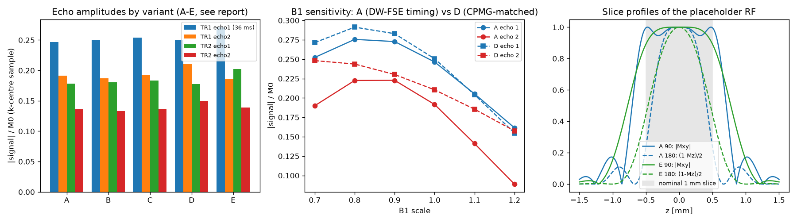

# Project report: DW-FSE (twoTE-1.6) in Pulseq

## 1. Goal and status

**Goal:** reproduce the MR Solutions DW-FSE sequence (`scanner/FSE_dwi_CPMG_non_CPMG_twoTE-1.6.ppl`) faithfully as a Pulseq file, to study stimulated/spurious echoes and B1/B0 sensitivity by simulation.

**Status:** done and validated. The repo is now one Python pipeline (`dw.py`: generate → view → simulate → plot → compare; see [README](README.md)).

The KomaMRI/Julia tooling was removed. The Python simulator gives the same echo amplitudes as KomaMRI within Monte-Carlo noise, can snapshot at any time (KomaMRI only at block ends), and runs a protocol in seconds. The optional `dw.py epg` (MRzeroCore) adds an echo-pathway breakdown.

The current PPR is a short test protocol: ETL 2, TE = ESP = 36 ms, b = 0, 1 slice, 8 dummies. The findings below come from that protocol and from the original one (ETL 32, b 6000, TE 54 / ESP 16 ms).

## 2. How it was validated

| check | result |
|---|---|
| PPL integer arithmetic replayed from the PPR | the b-value → DAC search gives 20119, the value stored in the PPR; the PPL's max b (13342 s/mm²) matches its own notes |
| PARSETUP emulation (FOV, thickness → DACs) | reproduces `gs_var`, `gr_var`, `gp_init_var`, `fov_slice_off` of the PPR exactly |
| Timing measured from RF/ADC centres | TE, ESP, first interval and Δ exactly as requested (e.g. 54.0000 / 16.0000 / 35.0000 / 40.000 ms) |
| CPMG moments, k-space | all train intervals have identical moments; phase-encode order matches the PPL table; every k-space line covered |
| Simulator vs KomaMRI (minimal protocol) | echo ratios agree to 0.5 %; absolute within the 1–5 % random-seed spread of a 20k-spin voxel |
| Snapshot at an echo centre | equals the simulated signal at that time (magnitude and phase) |
| PPL abort conditions | the generator stops on the same conditions with the same messages (TE/ESP/TR/Δ/b limits) |

## 3. Findings about the sequence

1. **The v1.6 independent-crusher code mis-centres every 180.** The PPL delays all RF and the ADC by `rfdelay` (60 µs) "to compensate for gradient group delay" (PPL:4100). The new crusher pads (PPL:1316-1317) cancel that delay for the 180s only. With a 60 µs gradient lag, the slice-select plateau is then 60 µs late relative to each 180: 4 µs margin before the RF, 124 µs after. That leaves about 93° of through-slice phase at each echo. The effect on echo amplitude was ≤ 3 % here, but it is a bug. Simulate it as written (default) or corrected with `sim_fix_refocus_centering=true`.
2. **The first interval breaks CPMG by design, and that costs signal and B1 robustness.** TE/2 ≠ ESP/2, and the first-180 crushers (2754 DAC) are about half the train crushers (5482 DAC). So the stimulated echo created by an imperfect first 180 never lands on a train echo.
   - With TE 36 / ESP 16 ms, echo 2 was 5 % below pure T2 decay.
   - With TE = ESP and equal crushers it was 32 % above, because the stimulated echo adds back.
   - Over B1 0.7–1.2, echo 2 varied 2.5× with the DW-FSE timing vs 1.6× CPMG-matched.
   - The current test PPR has TE = ESP but still unequal crushers; `dw.py epg` shows echo 2 is still 99.9 % primary pathway at B1 0.8.
3. **The b = 0 tests hide the main DW-FSE problem.** With b > 0, motion during the diffusion lobes adds a random phase that breaks the CPMG phase relation. `examples/ex6b` mimics this with a 90° excitation phase: at B1 0.8 the later echoes collapse (0.41 → 0.07). The simulator has static spins, so it shows this only when the phase error is added deliberately.
4. **RF pulse and slice thickness.** The vendor frame `3lobe_sinc_3kHz` is a truncated sinc (zero crossings every 333 µs, TBW 4); every sinc frame obeys bandwidth × duration = lobes + 1. The PPL sets the slice gradient for 71 % of the name bandwidth (2130 Hz), and the manual lists this frame as 2140 Hz. A plain truncated sinc therefore excites 1.42 mm (90°) / 0.82 mm (180°) instead of 1 mm. The 71 % may be a spin-echo-slice convention. The choice changes B1 results noticeably, so the RF model is a parameter (`sim_rf_model`, `sim_rf_apodization`).
5. **b-values.** The PPL computes b with 39.69 instead of (2π)² = 39.48, so a requested 6000 s/mm² is 5962 from the lobes. The read prephaser and readout add +7 % (6380 at echo 1). b = 0 rows play DAC 1, not zero.
6. **Smaller items:**
   - The phase-encode step truncates 40.86 → 40 DAC, giving a phase FOV of 35.77 mm vs 35.04 mm read.
   - TR 2 s with T1 1.5 s leaves Mz at about 0.73 between TRs; the PPR's dummies handle this.
   - The RF phases are plain CPMG (0° / 270°); "non-CPMG" in the name refers only to the unequal first interval.
   - The readout matrix is recomputed while active (PPL:3688, 3733). The values are unchanged; no effect is modelled.

*Minimal protocol (ETL 2, TE 36 / ESP 16 ms): echo amplitudes for timing/RF variants; B1 sweep for the DW-FSE timing (A) vs CPMG-matched (D); slice profiles of the RF models.*

## 4. Assumptions that matter (details in docs/ppl_to_pulseq.md)

| assumption | where to change it |
|---|---|
| hardware gradient lag = 60 µs (PPR `rfdelay`) | `hw_grad_delay_us` |
| refocusing flip = 180° (`p180_scale` treated as calibrated) | `sim_refocus_flip_deg` |
| RF = truncated sinc rebuilt from the frame name (vendor file unavailable) | `sim_rf_model`, `sim_rf_apodization`, `sim_rf_shape_file` |
| timing = the PPL's intended balance equations (code overheads of a few µs not modelled) | — |
| off-centre slice per-echo phase correction not applied (`acqpad()` unknown) | `sim_acqpad_ticks` |

## 5. Suggested next steps

1. Simulate the real train length (ETL ≥ 4, e.g. `--set views_per_seg=8 --set no_views=16`) with b > 0, using the B1 sweep and the EPG pathway breakdown.
2. Decide whether to fix the 180 centring in the PPL. `run fix --set sim_fix_refocus_centering=true` shows the effect.
3. Measure or obtain the RF frame (or the slice profile on a phantom) to settle the 71 % bandwidth question.
4. Consider equal first/train crushers or a phase-cycling scheme if B1 robustness of the train matters.
