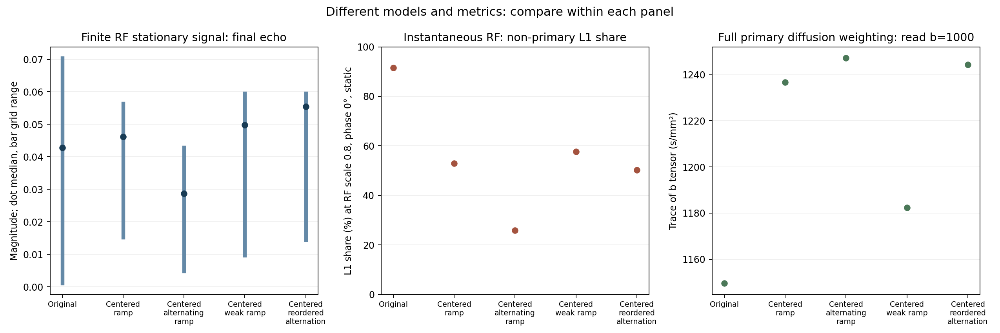

# DW-FSE combined-factor investigation

4 October 2026. Completed simulation research; scanner implementation and defaults were not changed by this investigation.

**Keep centered increasing crushers as the conservative balanced candidate.** A new alternating high/low ordering offers higher median late-echo signal and lower water-model contamination on the robustness panel, but loses more signal in the held-out high-RF/off-resonance conditions. A gentler ramp reduces diffusion and gradient costs, with weaker suppression and a demonstrated cancellation failure for narrow spatial support. No replacement improves every important metric. Image-quality improvement remains unverified.

## What is current and reproducible

The command-line default remains v1.6. The separate v1.7 scanner source already implements centering, signed built-in/custom crusher schedules and the PE0 memory guard. The patches still target v1.6; they are not additional changes to apply to v1.7. The increasing and increasing-alternating PPRs are explicitly selected experimental protocols. Scanner compilation, physical timing and phantom qualification remain open.

The original v1.6 PPL/PPR hashes match the earlier provenance. A bounded rerun of original and v1.7 increasing-alternating settings reproduced all archived complex pathway and finite-RF echoes exactly. The snapshot report's four-condition qualification statement is superseded by the later v1.7 grid. During this investigation an unrelated v1.7 setup-timer guard revision appeared in the shared working tree; it was preserved. These experiments use unchanged v1.6 generation with explicit overrides, so the guard does not affect their waveforms or validate scanner instruction timing.

## Tests and measurements

The search tested 41 configurations: the full centering × amplitude ramp × polarity factorial; increasing/decreasing, two-level high/low, reordered high/low, modulated, quadratic, geometric and seeded irregular schedules; gradient-energy matches; RF phase tables; fixed and varying refocusing angles; and shorter, moment-compensated crushers. Both crusher lobes around each RF match, and the special first-refocusing baseline is retained. Exact definitions and every screen result are in the [test table](data/combined_summary_screen_tests.csv) and [configurations](params/combined_factor_configs.json).

The initial screen uses ETL8, TE36 ms, ESP16 ms, requested read-axis b1000, RF scale .8/1, excitation phase error 0/90°, and B0=0. It uses 4,096 stratified spins. The shortlist was then tested on 24-condition panels spanning RF .7/.8/1/1.2, B0 0/100 Hz, phase 0/45/90°, nominal b0/1000 and read/slice/oblique directions. Seven held-out conditions add RF .9/1.1, B0 −75/150 Hz, phase 22.5/67.5° and new directions, plus ETL4/6/12. The four ETL8 held-out conditions are summarized below; shorter/longer trains remain separate in the CSV. Denser 16,000-spin sampling, a second seed, and 2-µs RF steps recheck finalists. ETL12 has finite-RF totals only.

The centered high/low ordering is a **supplemental timing-transfer test**. Its full panels followed the initial shortlist's held-out run and two limited transfer observations. Its amplitudes were not retuned, but it should not be described as an entirely untouched preregistered holdout. Selection history is saved in [selection metadata](data/combined_factor_selection.json).

Two models answer different questions. Finite-duration sinc-RF Bloch gives **stationary-spin total complex signal** with slice profiles. Exact instantaneous-RF pathways give primary, stimulated, remaining and total complex contributions in a 1-mm box, with static or model-water diffusion. Their absolute amplitudes have different normalization and must not be compared across models. RF scale .8 is a robustness test; excitation phase offsets are coherent error surrogates, not full motion. Neither is a scanner-setting recommendation.

Primary means the uninterrupted transverse route that conjugates at every refocusing pulse. Stimulated means excitation-derived histories visiting longitudinal storage; recovery histories are kept separately. Non-primary share is the sum of the other grouped-history magnitudes divided by the sum of all grouped-history magnitudes: an **L1 amplitude share**, not power, artifact fraction or SNR. The CSVs retain complex components, relative phases, all echoes, paired absolute differences/ratios, echo consistency and full primary b tensors.

## Results and decisions

Multipliers act on each RF's own crusher baseline. All centered cases retain the timing correction. The first entry 1 preserves the smaller first-RF crusher.

| Test ID | Exact changes | Conditions / decision |
|---|---|---|
| Original | Constant amplitudes; original timing | Matched reference throughout |
| Inc | Centering + `[1,1,1.4,1.8,2.2,2.6,3,3.4]` | Conservative balanced incumbent |
| Inc-alt | Inc amplitudes, signs `+−+−+−+−` | Strong suppression; high-RF signal failure |
| Weak | Centering + `[1,1,1.2,1.4,1.6,1.8,2,2.2]` | Lower diffusion/hardware cost; conditional alternative |
| Perm-alt | Centering + `[1,−1,3.4,−1.4,3,−1.8,2.6,−2.2]` | Promising new ordering; supplemental validation |

The next table's primary, stimulated and L1 metrics are instantaneous-RF E8 at RF .8, phase0, B0=0, requested read b1000. “Water” is D=.001 mm²/s in the compatibility model. Total/robustness columns are **separate stationary finite-RF** E8 grids.

| ID | Primary static / water | Coherent stimulated static | Non-primary L1 static / water | Total median, 24-point panel | Robust total min–max | Held-out ETL8 min / median |
|---|---:|---:|---:|---:|---:|---:|
| Original | .06675 / .02115 | .04673 | 91.6% / 92.1% | .04283 | .00111–.07039 | .03303 / .04898 |
| Inc | .06675 / .01939 | .03551 | 53.0% / 62.2% | .04623 | .01519–.05647 | .04038 / .04885 |
| Inc-alt | .06675 / .01919 | .00180 | 25.8% / 31.7% | .02870 | .00477–.04296 | .02044 / .03379 |
| Weak | .06675 / .02047 | .03035 | 57.6% / 69.6% | .04983 | .00964–.05953 | .03040 / .04646 |
| Perm-alt | .06675 / .01924 | .03299 | 50.2% / 49.9% | .05550 | .01446–.05953 | .03003 / .04459 |

These are equal-weight grid statistics, not expected patient SNR. Paired differences are saved for every echo against original and Inc. Center of k-space is echo1: all three centered increasing/permuted/weak schedules have the same first-echo response, with total ratios .966–1.100 and absolute changes −.00517 to+.02480 against original across the robustness panel. Original's nearly nulled calibrated/phase90 E8 changes from .00111 in screening to .00264 with dense second-seed sampling; reporting a huge fold gain from that null would be misleading. Dense absolute results, including matched baselines, are preserved.

| ID | E8 full b trace; addition to original (s/mm²) | Primary water retained | Peak gradient / slew | Timing and RF cost |
|---|---:|---:|---:|---|
| Original | 1149.64; 0 | 100% | 215.6 mT/m / 1078 T/m/s | Reference |
| Inc | 1236.77; +87.13 | 91.7% | 340.0 / 1700 | Same timing and RF energy |
| Inc-alt | 1247.19; +97.55 | 90.7% | 340.0 / 1700 | Same timing and RF energy |
| Weak | 1182.44; +32.80 | 96.8% | 220.0 / 1100 | Same timing and RF energy |
| Perm-alt | 1244.33; +94.69 | 91.0% | 340.0 / 1700 | Same timing and RF energy |

TE remains 36 ms, ESP16 ms and TR2 s; the upper-middle ADC sample is 25 µs after geometric echo center. Stronger peaks/slew are modeled logical-axis values within the repository envelope, **not measured scanner ratings**. Gradient/RF energy proxies are waveform integrals; RF energy is not SAR. The b tensor includes imaging, crushers, ramps and cross terms, rather than equating requested b to achieved trace.



## What the combinations demonstrated

**Amplitude and polarity interact strongly.** At RF .8/phase0, finite-RF E8 is .07039 original, .05864 increasing alone, .01656 constant alternation and .04221 increasing-plus-alternation. The interaction contrast `AB−A−B+original` is **+.03740**, rather than an additive response. Static L1 share has a **−25.70 percentage-point** interaction. At calibrated RF/phase90 the magnitude contrast reverses to −.05344. This is a directly measured, condition-dependent interaction, not a universal benefit of alternating signs.

**Reordering is a useful additional factor.** Decreasing and high/low permutations contain the same ordinary crusher strengths as the increasing ramp, matching peak and gradient energy. Polarity reversal also preserves gradient energy. They do not match b tensors: the temporal history and directional cross terms differ. The centered reordered alternating candidate improves panel median signal while retaining more unwanted coherent signal than Inc-alt. That is why a “purity winner” need not be the balanced winner.

**RF phases rearrange interference.** XY offsets can raise some total signals without lowering their unwanted L1 share. At RF .8/phase90, centered ramp × XY has interaction −.02400: the combination performs worse than an additive prediction. The RF component is supported by [diffusion X-PROP work](https://cds.ismrm.org/protected/20MProceedings/PDFfiles/4306.html); its odd/even reconstruction is not implemented here. The short phase probes are not complete stabilized non-CPMG methods.

**Lower-angle trains change which signal should be preserved.** The conservative taper `[180,180,175,170,165,160,155,150]` with Inc slightly raises the four-point finite-RF minimum, but reduces imperfect-RF water primary by **45.4% relative to matched Inc**, with L1 share rising 62.2→81.3%. Low-angle trains intentionally use stored/recalled signal. Our taper omits the 30-echo 180° startup and six-echo transition to90° of [published diffusion TRAPS-HASTE](https://cds.ismrm.org/protected/21MProceedings/PDFfiles/4196.html). These screens were not advanced as primary-preserving crusher candidates; their primary-path loss does not reject faithful TRAPS or its total-signal objective.

**Shorter crushers are not a free improvement.** Halving the ordinary crusher flat duration and increasing amplitude to preserve moment leaves RF/ADC timing fixed. Combined with Inc-alt it lowers b by only 13.31 s/mm² while raising modeled crusher peak/slew **71%**, to about 583 mT/m and 2914 T/m/s. That is an unattractive hardware exchange here. No relaxation loss was assigned to phase behavior by extending the train.

Two-level high/low, nonlinear, modulated and seeded-irregular alternatives were screened but did not establish a better combined compromise. Energy-normalized high/low and irregular controls match the full gradient-energy integral within 0.0060% and 0.00093%; their peaks differ. This is an explicit energy match, not an achieved-b or simultaneous peak match. Every screened alternative, including those not advanced, remains in the results table.

## Physical interpretation and independent audit

An RF refocus reverses phase evolution for the desired route; equal lobes cancel its stationary gradient history. A route stored longitudinally skips part of that evolution. Repeating moments can let it return later; varying their areas/order breaks some returns. RF phase and imperfect rotations determine whether returning contributions reinforce or oppose the primary. MRI adds these contributions as complex arrows: phase away from zero is not itself lost magnitude.

Stronger gradients also expose diffusing molecules to more phase dispersion. The static primary stays essentially unchanged, while its water amplitude falls with increased primary b. Longitudinal storage changes relaxation and diffusion exposure. Consequently, suppressing all stimulated amplitude can discard reinforcing signal or remove a low-angle train's intended storage mechanism.

An independent agent audited 528 acquired-MRzero echo-condition records with no failures under `absolute error ≤3×10⁻⁶ OR relative error ≤5×10⁻⁴`. The largest absolute discrepancy was 1.84×10⁻⁵; the largest relative discrepancy, .0591%, was a near-null weak-ramp case with absolute error 2.31×10⁻⁶. Analytic primary error was ≤1.52×10⁻⁸. Independent b integration agreed within 1.43×10⁻⁴ s/mm² per tensor element. Exact enumeration has no magnitude pruning through ETL8; it is not extended to ETL12.

MRzero's stored-grating diffusion convention omits the transverse `(2π)²` factor. A local physically motivated Fourier sensitivity check leaves primary signal unchanged but changes other contributions: Perm-alt's water L1 share changes 49.9→45.3% in the independent B0=37-Hz case. These are model diagnostics, not physiological stimulated fractions. Full-waveform versus imported-PDG b differs by 0.026–0.068%, explained by averaged gradients on ramps; RF-duration gradients and relaxation time remain included.

Additional .5/2-mm support and T2=.06/.10-s checks expose limits. Perm-alt total/original ranges .666–1.866, while reducing L1 share in every tested cell. Weak ranges .162–1.727, despite retaining 96.8% of primary water signal. These are direct cancellation counterexamples to universal total-signal improvement. Details and RF-step tolerances are in the [independent audit](research/combined_factor_audit.md).

## Imaging result and ranked next steps

Actual two-shot phantom ADCs were reconstructed on a 128×16 grid with the played trajectory and fixed prescribed receiver phase. Trajectory error is below 10⁻⁹ cycles/m and RF-step checks pass. Spatial quadrature fails the 5% image-ranking tolerance: original's seed-to-seed complex-image discrepancy is about **28.6% at 32,768 spins**, versus 55.5% at 8,192. The [phantom figure](figures/combined_factor_phantom.png) is explicitly unqualified. Slice-profile differences also prevent interpreting error against the instantaneous-RF reference as artifact error. Image-quality gain remains unverified; full method and failures are [documented](data/combined_phantom_notes.md).

1. **Qualify Inc first as the conservative compromise.** It has the highest minimum across the four held-out ETL8 conditions. Measure RF profiles/B1 and physical gradient delay, vendor-compile the scanner source, and check gradient/ADC centers and actual amplitude/slew limits.
2. **Add Perm-alt as the main new experimental alternative.** Compare its higher robustness-panel median and reduced water L1 share against its held-out losses. Use native signed custom tables only after timing/hardware qualification; do not replace scanner defaults.
3. **Use Weak when diffusion or gradient budget dominates.** Its 3.2% primary-water penalty is smaller than Inc's 8.3%, but the narrow-support cancellation failure needs targeted phantom testing.
4. **Resolve diffusion conventions and qualify image formation.** Obtain actual RF/gradient waveforms, calibrate each echo/direction's complete b tensor, and improve phantom spatial integration until image rankings converge. Then acquire stationary and water phantoms with b0/multiple directions, phase perturbations/motion, complex echoes and reconstructed images. Faithful stabilized non-CPMG, navigated preparations and variable-angle designs require their published receiver/startup/reconstruction handling; [primary-source notes](research/combined_factor_sources.md) specify those changes.

## Reproduction and technical appendix

The main search completed **851 evaluations** (377 finite-RF and474 exact-pathway), with a cache creation span of18.56 minutes and summed per-case elapsed time of36.16 minutes under parallel execution. Independent audit, reproduction and imaging are additional. Install the existing core requirements and optional MRzeroCore/torch. Versions, source hashes, search budget and stage counts are in [provenance](data/combined_factor_provenance.json); raw sequences, exact settings, acquired arrays and caches are under `runs/combined_factor_study`, `runs/combined_audit`, `runs/combined_design` and `runs/combined_phantom`. Original evidence tables remain available. All31 current regression tests pass; image spatial qualification still fails.

```powershell
python examples/reproduce_combined_prior.py
python examples/combined_factor_study.py screen
python examples/combined_factor_study.py pathways
$candidates = 'original,increasing_centering,increasing_alternating_centering,weak_increasing_centering,high_low_permutation_alternating'
python examples/combined_factor_study.py robust --variants $candidates
python examples/combined_factor_study.py heldout --variants $candidates
python examples/combined_factor_study.py robust --variants high_low_permutation_alternating_centering --label timing_transfer_robust
python examples/combined_factor_study.py heldout --variants high_low_permutation_alternating_centering --label timing_transfer_heldout
python examples/combined_factor_study.py sensitivity --variants $candidates
python examples/combined_factor_study.py rebuild
python examples/summarize_combined_factors.py
python examples/combined_factor_phantom.py --n 32768
python -m unittest discover -s tests -v
```

Supplementary dense calibrated/phase90 checks and exact auditor commands are listed in [the execution appendix](research/combined_factor_execution.md). The [design appendix](research/combined_factor_design.md) distinguishes initial proposals from executed conditions. [Paired per-echo metrics](data/combined_summary_paired.csv), [two-factor contrasts](data/combined_interactions.csv), [three-factor contrasts](data/combined_interactions_three_way.csv), [echo consistency](data/combined_summary_echo_consistency.csv), [grid summaries](data/combined_summary_grid.csv) and [full tensors/hardware](data/combined_factor_hardware_tensors.csv) provide the technical result tables.
