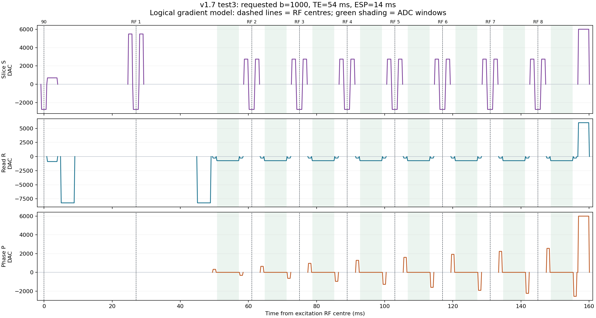

# Gradient and phase-variable reference for DW-FSE v1.7

5 October 2026. This maps the current scanner PPL, its matching PPR,
`m3040_15.pph`, `var_20.pph`, and the EVO manual (§5.5 and §5.6.1).
It covers gradient amplitudes, moments, durations, direction, list/matrix
selection, and the phase controls that accompany them.

## Reading a gradient in this source

The logical axes are **S = slice**, **P = phase encode**, **R = readout**.
They are rotated and calibrated onto the physical gradient coils. S does not
always mean physical Z. An oblique S gradient can drive all three coils.
The acquisition-table names `acq_x/y/z` correspond to logical **R/P/S** in
this implementation; the matrix macro accepts the opposite ordering:

```c
CREATE_MATRIX(id, slice_amplitude, phase_amplitude, read_amplitude)
```

A gradient list describes shapes and their timing; the matrix supplies the
signed amplitudes and orientation. These are separate layers:

| Source operation | Meaning |
|---|---|
| `POSPULSE(flat, clock)` | Primary trapezoid: ramp, plateau, ramp down |
| `NEGPULSE(flat, clock)` | Negative of that primary shape |
| `POSPULSE_SEC` / `NEGPULSE_SEC` | Same principle using the selected matrix's secondary amplitude bank |
| `POSPULSE_HOLD()` | Ramp up, hold until `MR3040_Continue`, then ramp down |
| `MR3040_InitList` | Allocate/build a list; does not play it |
| `MR3040_SetList` | Assign a list to logical channel(s) |
| `MR3040_SelectMatrix` | Choose amplitude/orientation scaling |
| `MR3040_Start` | Start the assigned lists |
| `MR3040_Continue` | Release a held list |

Secondary matrix IDs are primary ID +256. A secondary waveform is an
independently scaled part of the same gradient output, rather than an
additional physical coil. **A positive shape multiplied by a negative matrix
amplitude plays a negative gradient.** A variable's name or `POSPULSE` alone
does not establish physical polarity.

Amplitudes below are logical DAC values. With the source's reference
calibration, frequency-gradient strength is approximately
`DAC * grad_var[0] / 32767` Hz/mm. Convert Hz/mm to Hz/m by multiplying by
1000, then divide by the proton gyromagnetic ratio in Hz/T for T/m.
This describes the calibration convention, not a measured amplifier waveform.

For a trapezoid with ramp duration r and flat duration t:

- Total duration = `t + 2*r`.
- Area = `amplitude * (t + r)`.

Area is the relevant quantity for stationary-spin phase winding; full timing
and the RF history also matter for diffusion and coherence pathways.

## What plays in one shot

1. Optional preparation RF/gradients: presaturation, fat saturation, MTC/CEST.
2. Slice-selection gradient during the excitation RF.
3. Initial slice rephasing and initial read prephasing, according to the lobe split controls.
4. First diffusion lobe.
5. First crusher — first refocusing RF with slice-selection gradient — matching first crusher.
6. Second diffusion lobe, with the same commanded vector as the first.
7. Imaging block: pre-read lobes, readout/ADC, post-read lobes.
8. Later crusher pairs/refocusing RFs and imaging blocks repeat at ESP.
9. Optional driven-equilibrium block and/or post-train spoiler.

The diffusion lobes are around the **first** refocusing RF, not around every
imaging RF. The dedicated crusher pairs are around every refocusing RF.
The first diffusion echo has its separate TE budget; later imaging spacing
uses ESP.



This figure uses the saved **test3** PPR, requested b=1000, an imaging shot,
and its own crusher settings. Dashed lines mark RF centres and shading marks
ADC windows. The end spoiler appears on all three logical axes. This is the
repository's gradient model, not a captured scanner instruction trace. It
does not model all optional preparation branches or measured gradient response.

## Imaging amplitudes and geometry

| Variables | Meaning |
|---|---|
| `grad_var[4]`, `grad_varl`, `grad_var_l[4]`, `dacmax`, `dacmaxlong` | Reference/axis gradient calibration, wide/converted calibration storage, and DAC full scale; used by the base matrix and scaling calculations |
| `gs_var` | Slice-gradient amplitude returned by parameter setup for the nominal 1070-Hz RF bandwidth |
| `gs_var1` | Slice amplitude after the optional 3D slab-thickness adjustment |
| `pulse_bwdth`, `bw_override`, `rf_bwdth[]` | RF bandwidth used to scale the slice gradient; this source uses 71% of the waveform's nominal bandwidth |
| `gs_var_rescale` | Actual primary slice-selection amplitude: approximately `gs_var1*pulse_bwdth/1070` |
| `gr_var` | Read-gradient amplitude returned from FOV and sampling setup |
| `oversample`, `gr_oversample`, `gr_undersample` | Read sampling/FOV factors; the played read amplitude is `(gr_on*gr_undersample)*(gr_var/gr_oversample)`, with integer division in that order |
| `oversample2`, `gp_oversample`, `gp_undersample`, `FOVf` | Phase FOV/oversampling factors used to calculate PE increments |
| `gs_comp` | Baseline slice-rephasing amplitude calculated from half the excitation slice-gradient area |
| `gr_comp` | Baseline read-prephasing amplitude calculated from half the read-gradient area |
| `gs_comp_scale`, `fse_gs_comp` | Small adjustment of the slice-compensation budget; `fse_gs_comp` is initialized to zero |
| `gr_comp_scale` | Small adjustment of the read-compensation budget; the actual source factor is approximately `1+gr_comp_scale/8000`, despite the UI's `%` label |
| `gsp_lobe`, `gs_rp`, `gsp_rp` | How much slice compensation is moved from the initial post-excitation lobe into the lobes around each readout; formulas below |
| `grp_lobe`, `grp_dp`, `gr_dp` | How much read prephasing is moved into the initial pre-first-refocusing lobe versus the lobes around each readout; formulas below |
| `gr_comp_flow`, `grp_dp_1`, `gr_flow`, `G1`, `G2`, `flow_comp_on`, `t_flow` | Optional read-axis first-order flow-compensation amplitudes/extra timing. Normally `G1=grp_dp`, `G2=0`. Flow mode changes both initial read lobes; the source itself marks its separated tref/tdp formula as needing verification |
| `gs_on`, `gp_on`, `gr_on` | Enable imaging slice/phase/read amplitudes; `gr_on=-1` also reverses read imaging polarity. `gs_on` also gates the dedicated slice crushers |
| `phase_var`, `s_angle_var[]`, `p_angle_var[]`, `r_angle_var[]`, `pos_index` | Per-slice logical orientation and phase/read assignment |
| `subj_angle_x/y/z` | Base orientation rotations before per-slice transformations |

The baseline compensation formulas, omitting truncation, are:

```text
gs_comp = gs_var_rescale * (tsel90+tramp)/2 / (tref+tramp)
gr_comp = gr_var * (tacq+tramp)/2 / (tdp+tramp)
          * gr_undersample/gr_oversample
```

These are gradient-area balances, rather than arbitrary spoiler strengths.
The source uses integer operations, so its exact order matters.

## Exactly what gsp_lobe and grp_lobe do

The decisive code is in PPL lines 3248–3287.

For slice compensation, define the adjusted budget A and fraction f:

```text
A = gs_comp + gs_comp*(gs_comp_scale+fse_gs_comp)/1000
f = gsp_lobe/100

gs_rp  = A*(1-f)
gsp_rp = A*f*(tref+tramp)/(tdp+tramp)
```

The initial `slice_list` uses **`-gs_rp`** after excitation. The per-echo
`slice_list_rp` uses **`+gsp_rp`** before and after the readout. The duration
ratio preserves the moved area when changing from a tref lobe to a tdp lobe.

| `gsp_lobe` | Initial compensation | Per-readout compensation |
|---:|---|---|
| 0 | Entire budget in the initial lobe | Zero |
| 100 | Initial lobe zero | Entire budget transferred |
| >100 | Remaining initial component reverses sign | More than the original budget transferred |

For read compensation without flow compensation:

```text
B = gr_comp + (gr_comp*gr_comp_scale/8)/1000
h = grp_lobe/100

gr_dp  = B*(1-h)
grp_dp = -B*h*(tdp+tramp)/(tref+tramp)
```

The initial `read_pre_list` uses **`-grp_dp`** before the first refocusing
pulse. The per-echo `read_list` uses **`-gr_dp`**, main read gradient,
**`-gr_dp`**. Thus `grp_lobe=0` puts the baseline prephasing into the
per-readout lobes; 100 moves it into the initial lobe; above 100 reverses the
remaining per-readout components.

Redistributing these moments changes which unwanted pathways can refocus.
These sliders can consequently have spoiling effects, but they are separate
from the independent crusher amplitude/schedule controls.

### Matching v1.7 PPR example

These values describe `scanner/...twoTE-1.7.ppr`, not every experimental PPR:

| Quantity | Value / played meaning |
|---|---|
| `tramp`, `tdp`, `tref` | 200, 700, 2800 us |
| `gsp_lobe` | 0 |
| `gs_rp`, `gsp_rp` | -699, 0 DAC: initial slice rephaser plays +699; extra 2D slice lobes around ADC are zero |
| `grp_lobe` | 110 |
| `grp_dp`, `gr_dp` | +889, +269 DAC: initial read prephaser plays -889; per-readout side lobes play -269 |
| Main read amplitude | -735 DAC |
| `crush_amp`, `diff_crush_amp` | +5482, +2754 DAC, separate from the above imaging components |
| `gr_comp_scale` | Raw value 2; its nominal correction is 0.025%, and integer truncation leaves this example's gr_comp unchanged |

This example also shows why confusing `gsp_lobe=0` with "no slice crushers"
is incorrect: the independent crushers remain nonzero.

## Phase encoding, including 3D and navigators

| Variables | Meaning |
|---|---|
| `gp_init_var` | Initial PE amplitude supplied by FOV setup, rescaled for the actual tdp/ramp timing |
| `gp_inc` | One PE-line amplitude increment |
| `gp_mul` | Signed k-space line index from the ordering table |
| `gp_var` | Current PE amplitude: `-gp_inc*gp_mul*nav_cnt` |
| `PE_order`, `views_per_seg`, `views_per_echo`, `pe_shots`, `PF_echoes`, `te_eff`, `current_view`, `echo_cnt` | Choose which PE index is acquired at each echo/shot; these affect the PE waveform through gp_mul |
| `get_gp_order`, `put_gp_order`, `gp_cnt`, `gp_loc`, `gp_store`, `phase_count`, `phase_offset`, `array_count`, `cnt`, `echo`, `shot`, `pe_center_echo`, `pe_echo_index`, `pe_center_te_us` | Ordering-table construction/indexing, rather than additional gradient amplitudes |
| `no_views_2`, `gp_sl_init_var`, `gp_sl_inc`, `gp_sl_var`, `gp_sl_on`, `get_gp_var_mul2` | Optional 3D second PE direction on logical S |
| `fov_sl`, `slab_ratio`, `oversample3`, `gp2_oversample`, `pe2_centric_on` | 3D geometry, sampling and ordering |
| `nav_on`, `nav_cnt` | Navigator control; nav_cnt=0 disables both PE directions for the navigator train; imaging trains use 1 |

The phase list plays `-gp_var` before readout and `+gp_var` afterward: a PE
lobe and its rewinder. During the ADC there is no sustained phase gradient.
In 3D, the slice-side lobes have amplitudes
`gsp_rp-gp_sl_var*gp_sl_on*nav_cnt` before readout and
`gsp_rp+gp_sl_var*gp_sl_on*nav_cnt` afterward. This combines a same-polarity
slice-compensation component with an opposite-polarity second PE component.

## Dedicated refocusing crushers

| Variables | Meaning |
|---|---|
| `crush_independent_on` | 1: separate crusher/RF/crusher lobes; 0: legacy extended slice-selection plateau |
| `crush_amp`, `diff_crush_amp` | Ordinary and special first-DWI signed crusher baselines |
| `tcrush`, `diff_tcrush`, `tcrush1`, `first_crush_flat` | Crusher **flat** durations; first DWI pulse uses diff_tcrush, later pulses tcrush |
| `crusher_schedule`, `crusher_step_pct` | Constant/up/alternate/up+alternate/down/custom mode and additive progression step |
| `crusher_custom_pct[64]`, `crusher_custom_count` | Explicit signed percentage table and validated active length |
| `crusher_dac[1024]`, `crusher_etl` | Final signed amplitudes and train length; element k-1 corresponds to RF k |
| `crusher_saved_first`, `crusher_saved_train` | Snapshotted baselines |
| `crusher_i`, `crusher_sign`, `crusher_base`, `crusher_factor`, `crusher_steps`, `crusher_mag`, `crusher_result` | Schedule construction/rounding scratch variables |
| `crusher_max_dac`, `crusher_slew_dac_100us` | Configured logical amplitude and ramp-slew limits |
| `crush_rf_flat`, `crush_rf_pad` | Rounded primary slice-gradient plateau around refocusing RF and its extra margin |
| `crush_pre_pad`, `crush_post_pad` | Equal timing budgets for extra ramps/half RF margin; not extra crusher flat time |
| `tcrush_play`, `tcrush1_play`, `this_tcrush` | RF-start timing budgets including the pads; not the trapezoid's physical flat duration |
| `crusher_play_mat`, `total_echo_cnt` | Active matrix pair and one-based pulse progression via a zero-based completed-pulse counter |
| `crusher_setup_ticks`, `crusher_update_ticks`, `crusher_update_max_ticks`, `crusher_adc_remaining` | Execution-time budget measurements/accounting; do not set gradient strength |

Each independent list contains `POSPULSE_SEC`, `POSPULSE`, `POSPULSE_SEC`.
The secondary matrix is `(S=C_k, P=0, R=0)` and the primary is
`(S=gs_var_rescale, P=0, R=0)`, multiplied by gs_on. Thus the crusher lobes
and RF slice gradient have separate amplitude controls. Both lobes around
RF k share C_k, duration, shape and polarity. C_k may change at the next RF.

Legacy mode has one continuous slice-gradient plateau of
`tsel90 + 2*tcrush` (first DWI: `tsel90 + 2*diff_tcrush`). Its outside-RF
parts supply crusher area at the slice-selection amplitude; independent
crusher DAC parameters do not control that legacy waveform.

## Diffusion gradients

| Variables | Meaning |
|---|---|
| `diff_on` | Master diffusion-lobe switch; distinct from imaging gs_on/gp_on/gr_on |
| `b_input_mode`, `acq_b[]`, `acq_grad[]`, `no_diff_acq`, `diff_acq_cnt` | Requested b or scalar DAC, acquisition-table length/current row |
| `acq_x/y/z[]` | Direction components normalized to 1000, interpreted as logical R/P/S |
| `diff_grad_scale`, `diff_scale_saved`, `diff_grad` | Input scale, validated saved scale, and resulting scalar DAC |
| `diff_read`, `diff_phase`, `diff_slice` | Quantized direction-weighted DAC components |
| `diff_abs_read/phase/slice`, `diff_non_zero` | DAC-1 fallback direction selection and nonzero-vector flag |
| `sm_delta`, `sm_delta_us` | Little delta: flat plus one ramp; total trapezoid lasts delta + ramp |
| `big_delta`, `big_delta_us` | Lobe-onset separation; equivalent centre separation for identical lobes |
| `diff_tramp`, `diff_clock` | Diffusion ramp duration/gradient clock; current DWI code requires diff_tramp=tramp |
| `extra_delta`, `extra_delta_us`, `extra_delta2_us`, `space_pre`, `space_post` | Available gaps placing the diffusion pair around RF 1 |
| `big_delta_min`, `big_delta_max_4_given_TE`, `min_pre`, `min_post`, `true_half_te_us` | Placement/timing feasibility bounds |
| `b_kfac`, `b_target`, `b_trial`, `b_max`, `b_diff_read/phase/slice`, `dac_lo/hi/mid`, `b_calc_cnt`, `b_inc`, `max_diff_grad`, `max_diff_grad_pc` | Existing nominal diffusion-module calibration, DAC search and reporting; these are not extra gradient lobes |

`diff_mat` is created with **`(-diff_slice,-diff_phase,-diff_read)`**.
Both diffusion lobes use the same positive held list and this same matrix,
so their commanded vectors have the same polarity. The RF between them
reverses their effective phase sign for the desired stationary-spin pathway.
The matrix does not multiply these components by the imaging enable flags.
Turning gr_on off therefore does not turn off read-axis diffusion.

The full b tensor includes diffusion, imaging, slice and crusher ramps and
cross-terms. Zero net phase at an echo does not imply zero diffusion weighting.

## Timing and position variables

| Variables | Meaning |
|---|---|
| `tramp`, `clock` | Ramp duration in us; clock=tramp/5 in 100-ns clock units, corresponding to 50 ramp samples |
| `tref_setup`, `tref`, `tdp` | User duration, initial compensation flat `4*tref_setup`, and per-readout lobe flat `tref_setup` |
| `sample_period`, `sample_period_l`, `no_samples`, `no_discard`, `tacq`, `tacq_int`, `tacq_2` | Sample period in 100-ns units, sample counts, full and half acquisition duration in us |
| `tsel90`, `tsel180`, `rfnum`, `rf_length[]` | RF duration/shape selection; RF choice also sets slice-gradient amplitude and timings |
| `rfdelay`, `rfgate_delay`, `warmup` | Gradient-delay compensation, RF gate/start delay and amplifier warmup; distinct timing roles |
| `te`, `esp`, `te_a`, `te_b`, `te_balance_al/bl`, `te_balance_bl_esp`, `te_balance_bl_temp1/2`, `te_balance_bl_temp1_esp` | TE/ESP and the delays needed around gradient/RF/ADC blocks |
| `post_adc_base_ticks`, `post_adc_train_ticks`, `refocus_wait_ticks`, `post_90_delay0L`, `pre_90_delay0L`, `post_90_delay1`, `rf_extend_delay` | Actual timer targets/balance delays; ticks are 100 ns where named/in their played expressions |
| `fov_slice_off[]`, `slice_offset`, `slice_mm_10`, `fov_read_off[]`, `fov_phase_off[]` | Position inputs. Slice/read offsets largely become RF/receiver frequency offsets; phase offsets become receiver phase ramps rather than extra gradient lobes |
| `slice_freq_long`, `slice_freq_var`, `read_freq_long`, `rec_freq`, `fov_slice_freq`, `fov_read_freq` | Transmit/receive frequency offsets accompanying spatial gradients |
| `fov_phase_deg`, `fov_sl_phase_deg`, `fov_sl_phase_off`, `scale_read_off`, `scale_phase_off`, `scale_slice_off` | Position-to-phase/frequency conversion quantities |

## phcor is a phase-correction timing coefficient

The active calculation is `NEWPHCOR` at PPL lines 3064–3091. Define:

```text
fTX = slice_freq_long + slice_freq_var
fRX = -(read_freq_long + rec_freq)
phcor = phcor_plus if fTX > 0, otherwise phcor_minus

X = (fTX+fRX) * [overhead + 1.6*(tacq+tramp)]
    + 1.6*(phcor*fTX + r_phcor*fRX)
```

Integer division of X by 1000 supplies a per-echo phase increment and its
fractional remainder. The factors encode the 0.225-degree phase resolution.
`phcor_plus/minus` and `r_phcor` act as **microsecond-equivalent timing
corrections**, although their UI fields do not show units. They are not
gradient DACs or directly entered degrees. For example, phcor=23 at a
1000-Hz transmit offset contributes about 8.28 degrees per increment.
At zero offsets it contributes zero, regardless of the value 23.

| Variables | Meaning |
|---|---|
| `phcor_plus`, `phcor_minus`, `phcor` | Positive/nonpositive transmit-offset timing adjustment and its selected value; selection does not follow crusher polarity |
| `r_phcor` | Independent timing-equivalent read/receiver frequency correction |
| `overhead`, `group_delay`, `extra_val`, `tfilter` | Empirical receiver/filter delay corrections; group delay is obtained from acqpad |
| `overhead_var` | Used in the disabled ORIGINAL_CODE formula; ignored by active NEWPHCOR |
| `phase_ang`, `remainder_phase` | Integer phase increment and retained fraction |
| `phase_correction_0/1/2`, `phase_correction` | Echo-indexed accumulated correction with fractional rounding |
| `phase_res`, `deg_90`, `deg_360` | Phase hardware step and 90/360-degree equivalents; phase_res=225 means 0.225 degrees per step |
| `phase_90`, `phase_180`, `phase_cycle`, `phase_rec` | RF phase cycle and receiver phase; phase_rec includes PE-dependent position correction |
| `phcor0` | Separate direct RF phase offset in hardware phase steps; first refocusing setup uses phase_180-phcor0. Its `0*phcor0` term in ADC phase calculation has no effect |

The corrections are passed to `phase()` / `rphase()`, not to gradient matrix
amplitudes. A uniform phase correction cannot undo position-dependent phase
from an incorrectly balanced gradient moment.

## Other spoilers and optional blocks

| Variables / block | Gradient behavior |
|---|---|
| `post_crush_on`, `post_crush_amp`, `post_tcrush`, `post_crush_list`, `post_crush_mat` | After the train, matrix `(-gs_on*A,-gp_on*A,-gr_on*A)` drives all enabled logical axes. Matching PPR: A=-6000, so each enabled axis plays +6000 DAC |
| `sat_on`, `PB_on[]`, `PB_channel[]`, `PB_gs_sat[]`, `gs_sat`, `sat_list`, `sat_tcrush`, `sat_gr_amp`, `sat_on_ar[]` | Spatial presaturation selection on its configured logical axis, then spoiler on the other two axes; block thickness/FOV and sat_pulse_bwdth determine selection strength |
| `PB_thk[]`, `PB_FOV[]`, `PB_offset[]`, `PB_freq[]`, `PB_kHz[]`, `PB_Hz[]`, `sat_mode`, `PB_gap`, `sat_fov_scale`, `sat_offset` | Presaturation geometry/frequency inputs, including travelling-block positioning |
| `chess_on`, `gs_chess_amp`, `tcrush_chess`, `chess_list`, `chess_mat` | Fat-saturation spoiler on logical S, at amplitude -gs_chess_amp |
| `mtc_on`, `mtc_gr_amp`, `mtc_tcrush`, `mtc_list`, `mtc_mat` | MTC/CEST prepares an all-axis spoiler matrix/list. The current MTC branch selects them but contains no MR3040_Start call; list creation/selection alone is not evidence it actually plays. This optional branch needs a separate execution check before describing it as a played spoiler |
| `de_on`, `slice_de90_list`, `read_de90_list`, `de_phase` | Optional driven-equilibrium terminal RF/gradient block, reversing the initial arrangement to return magnetization toward longitudinal storage; independent crusher mode rejects DE ON |

The matching v1.7 PPR has preparation options and flow compensation off,
while its post-train spoiler is on. This alone disproves the broader statement
that all crushers/spoilers in this program are slice-only.

## Matrix/list dictionary

| Matrix | Lists / amplitudes |
|---|---|
| `ss_mat=1` | Zero matrix used during safe preparation/validation |
| `fse_mat=23`, `fse_mat_sec=279` | Excitation `slice_list` and `read_pre_list`: primary (slice selection,0,G2), secondary (gs_rp,0,G1), with imaging enable flags |
| `slice_crush=21`, secondary 277; `first_slice_crush=22`, secondary 278 | Independent refocusing lists, with primary slice selection and secondary slice-only crusher; variable schedules alternate these matrix pairs |
| `aq_mat=3`, `aq_mat_sec=259` | `read_list`, `phase_list`, `slice_list_rp`; primary main read, secondary compensation/PE amplitudes |
| `diff_mat=60` | `diff_list`: held diffusion waveform on all channels with the signed direction vector |
| `presat_mat=24`, secondary 280 | `sat_list`: selected-axis RF plateau and other-axis spoiler |
| `chess_mat=6` | `chess_list`: slice-axis fat-sat spoiler |
| `mtc_mat=25` | Prepared `mtc_list`; execution caveat above |
| `post_crush_mat=30` | `post_crush_list`: terminal all-axis spoiler |

**Unused storage is not a hidden played gradient.** `slice_180_crush` and
`diff_list2` are built but never selected in this PPL. `gp_dp`,
`gp_var_calc`, `gp_var_calc_rescale`, `read_list_dp`, `phase_list_dp` and
`stim_tcrush` are legacy declarations without active use. Standard includes
also declare unused controls such as `grad_spoil_on/amp`, `gr_crush`,
`gs_crush`, and `gp_crush`; they do not control the independent crushers.

## Why the dedicated pairs use the slice direction

The source reason is explicit: the crusher secondary matrix has nonzero S
and zero P/R, and the refocusing list starts only CHANNEL_S. Physics does
not require that choice. It is a conventional implementation whose likely
advantages are compatibility with selective RF, keeping crushers separate
from the PE/read encoders, and phase winding across the slice thickness.
Those design motivations are interpretation, not an author statement in the
source.

For an unwanted transverse component, phase across distance L is
approximately `2*pi*gamma_Hz*crusher_area*L`. A single direction can cause
signal cancellation through phase dispersion across the voxel. For the
intended stationary-spin echo, an ideal 180 pulse reverses the first
crusher's phase and the equal same-polarity second crusher cancels it.
Signals created by imperfect RF or following other storage/refocusing
histories do not necessarily receive that cancellation.

A thicker slice can provide more phase winding for a given area than a
smaller in-plane voxel width. The dependence on voxel size is documented
in [Magland et al., 2009](https://pmc.ncbi.nlm.nih.gov/articles/PMC2731673/).
That is a practical reason to choose S in a 2D sequence; it does not prove
S is optimal for every protocol.

Slice-only crushing is not guaranteed to remove every stimulated echo.
Changing crusher area between pulses breaks some repeated pathway balances;
the repository's alternating/increasing results are specific comparisons.
Read/phase/vector crushers are feasible designs too. They require equal
pre/post **vectors**, valid moments at each ADC, hardware limits, and updated
full b tensors. Adding axes or aligning crushers with diffusion can create
new pathway interactions. [Nagy and Weiskopf, 2013/2014](https://onlinelibrary.wiley.com/doi/full/10.1002/mrm.24676)
demonstrated crusher/diffusion cancellation and an orthogonal-vector remedy
in a twice-refocused diffusion sequence; that is relevant evidence, not
qualification of such a change for this DW-FSE implementation.

## Reproduce the waveform inspection

```powershell
python examples/explain_gradients_v17.py
python dw.py gen runs/gradient_reference.seq --ppr experiments/FSE-DWI_10-04-2026_v17_test3/FSE-DWI_10-04-2026_v17_test3.ppr --reduced
python -m dwfse.btensor runs/gradient_reference.seq --out runs/gradient_reference_tensor
```

Use `--full` instead of `--reduced` to export all rows/shots/slices/dummies.
The tensor export includes gradient ramps and the RF sign changes. Exports
remain in logical R/P/S coordinates unless a verified physical orientation
and calibration transform is applied. The scanner gradient library
`c:\smis\seqlib\g3040_15.seq` is referenced by the PPL but is not in this
checkout; measured amplifier waveforms/gradient lag are also unavailable.
