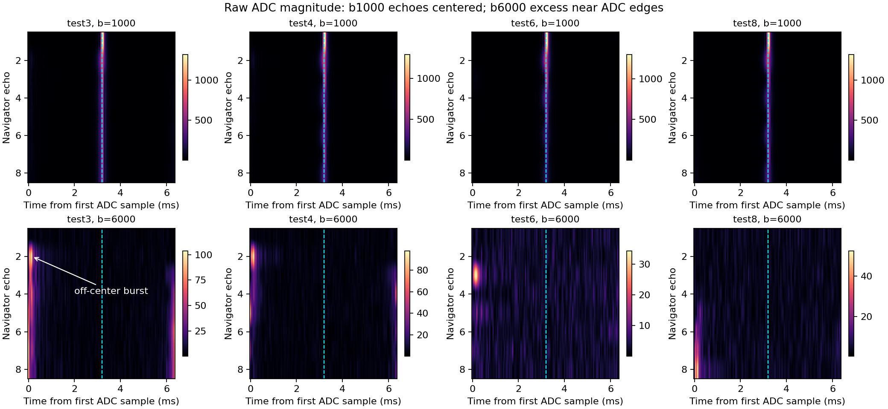
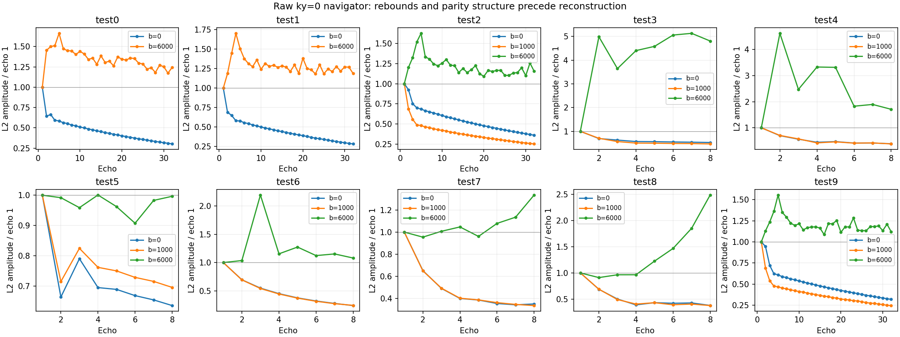
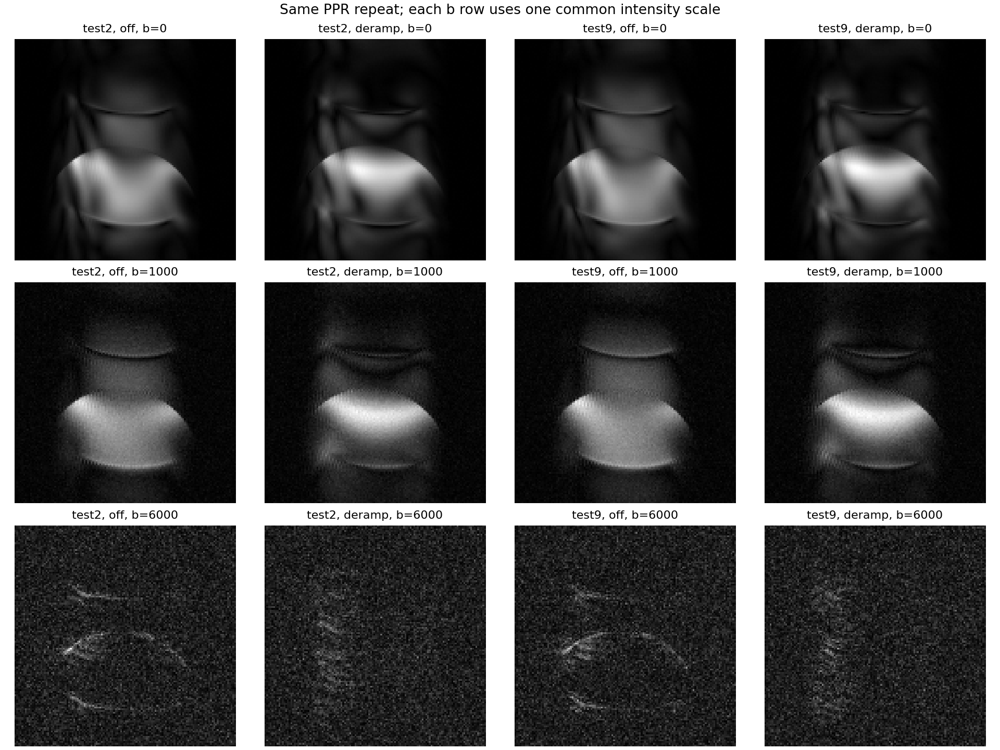

# Physical scanner experiments — October 4, 2026

**The most convincing result is suppression of off-center signal by changing the train crushers, with a substantial late-echo signal trade-off.** Test3 has strong unwanted signal near the readout-window edges at b=6000. Increasing crushers reduce it; increasing with alternating polarity reduces it further. Strong decreasing crushers also suppress most early contamination, but weaker decreasing crushers let it return late in the train. None of these observations establishes that a particular schedule produces the best quantitative diffusion image.

**Two features should not be mistaken for sequence failures.** These were water-phantom scans using a surface coil on a 9.4 T MR Solutions small-animal scanner. Surface-coil receive sensitivity naturally produces a bright region near the coil and a darker distant region. Also, b=6000 largely extinguishes the intended water signal. The striking residual arcs in some high-b images are therefore a useful contamination detector, rather than convincing recovered diffusion signal.

There are genuine problems beyond that expected shading: repeated arcs/ringing, strong odd/even echo phase differences, and readout-edge bursts. The reconstruction also changes the apparent brightness distribution: applying one navigator phase per echo is consequential and does not adequately describe every spatial profile. Test2/test9 reproduce the broad behavior well; they suggest modest phase/signal variability, not a major scanner deterioration.

## What was actually acquired

I checked all 12 MRDs, their embedded acquisition protocols, sidecar PPRs, available NIfTIs, saved image/k-space PNGs, and test4's projected T2 plots. The [catalog](../experiments/scan_catalog_2026-10-04.md) is a useful starting point, but the **MRD-embedded protocol takes precedence**:

- **Test0 acquired ESP=14 ms, although its saved PPR says 16 ms.** Test1 acquired 16 ms. Their comparison therefore does not isolate the v1.7 centering change.
- Test0, test1, and both named increasing scans acquired one centered orientation/offset entry. Their sidecars retain three entries at −1.2/0/+1.2 mm. All raw files contain one slice; multislice cross-talk is not supported as an explanation here.
- The named scans' acquired phase-encode calibration is `gp_init_var=-117`, `SMY=0.00359301`; their sidecars retain −1177/0.0359301. Their raw data have **16 imaging lines**, not 128. They are low-resolution diagnostics, not directly comparable images.
- Test2 and test9 have byte-identical sidecar PPRs. Their embedded protocols differ only in `AcquisitionStartTime`; recorded TX/RX gains, frequency fields and software gradient delays also match. All scans record TX gain −198 and RX gain 180. These entries do not measure actual resonance or amplifier delay.

The supplied [v1.7 PPL](../scanner/FSE_dwi_CPMG_non_CPMG_twoTE-1.7.ppl) is the source the user identifies as compiled and run today. Relative to v1.6 it implements symmetric independent-crusher RF padding, signed amplitude schedules, matrix updates during acquisition, and PE0 scratch bounds. All scans use PE1, so the PE0 fix cannot explain their differences. RF shapes, nominal flip controls, CPMG phase convention and diffusion calibration are retained. A *crusher* is a gradient pair around a refocusing RF pulse that dephases unwanted magnetization while allowing the intended spin echo to refocus.

The current uncommitted scanner source also differs from the archived v1.7 implementation: its matrix-setup window is **30000 ticks = 3 ms**, its guard is **24500 ticks**, and its TR overhead accounting increases from 10200 to **11350 µs**, matching the extra 1.15 ms setup time. Some comments and [scanner documentation](scanner_v17.md) still describe the earlier 1.85 ms window. These edits precede excitation and are intended to preserve requested TR, rather than change TE/ESP. Their physical timing is not established by a PPR or the previous simulations. The analyzed source SHA-256 is recorded in the [analysis JSON](data/physical_scanner_analysis_2026-10-04.json).

Thus there is stronger source provenance than the earlier simulation reports had, thanks to the user's identification of the run source. There is still no per-scan executable hash, compiled instruction listing, or measured RF/gradient/ADC trace linking every acquisition to an exact build. The saved PPR schedule fields confirm requested controls, not independently measured crusher waveforms. Existing uncommitted research files and source edits were inspected and preserved.

## Comparison in acquisition order

`TE/ESP/Δ` below means first echo time / train echo spacing / diffusion-lobe separation, in ms. All scans use TR=2000 ms, 128 read samples at 50 µs, 35 mm FOV, 1 mm slice, diffusion duration 4 ms, and read-axis diffusion. Crusher numbers are first/train baseline DACs before schedule scaling. Numbered scans acquire b=0/1000/6000 except test0/test1, which acquire 0/6000.

| Scan | Acquired settings | Image and raw-echo observations |
|---|---|---|
| **test0**, v1.6 | 54/**14**/40; 160 views, ETL32; 2754/5482, constant | Strong localized b0 signal with replicas/arcs and fine vertical fringes. Navigator E2 falls to 0.65 of E1, E3 rebounds slightly. High-b image is mostly noise with weak structured residuals; raw excess lies near ADC edges. |
| **test1**, v1.7 | 54/16/40; 160, ETL32; 2754/5482, constant | Similar b0 shading/replicas; no clear centering-only improvement. E2/E32 are 0.69/0.28. High-b early edge excess persists. PNGs are absent; its NIfTI and independent reconstruction were inspected. |
| **test2** | 54/14/40; 160, ETL32; 5482/5482, constant | E2 is retained better at b0 (0.92), but strong broad replicas remain. b1000 has a recognizable phantom and weaker replicas. E32 b1000=0.25. High-b has weak edge bursts, not a robust centered echo. |
| **test3** | 54/14/40; 136, ETL8; 5482/2741, constant | Less extensive ghost structure than ETL32, but repeated arcs and fine edge ringing remain. High-b shows the clearest false-looking rim/arc image. E2–E8 high-b navigator norms reach about 3.6–5.1× E1, driven by edge bursts. |
| **test4** | Same as test3; increasing, step40% | Similar b0/b1000 images, lower late echo amplitude and more pronounced odd/even behavior. High-b rim contamination is reduced but remains. E8 norm falls from test3's 177 to 63 raw units; E2 burst remains strong. |
| **test5**, v1.3 | 54/15/**32**; 136, ETL8; legacy coupled crushers, **2 ms** | b1000 looks comparatively smooth with fewer fine fringes; b0 still has arcs. E3 rebounds after E2. High-b is approximately noise-like, without test3's large edge bursts. Legacy RF/gradient geometry, ESP and Δ all differ; this is not a schedule-only control. |
| **test6** | Same as test4; increasing + alternating | Smoothly falling b0/b1000 navigator magnitudes; E8 b1000=0.24 versus test4's 0.38. Repeated image arcs persist. High-b rim largely disappears; a smaller E3 edge burst remains and E8 is near the noise floor. |
| **increasing** | **36/16/20**; **16 views**, ETL8; 2754/5482; nav off, 8 dummies; b0/1000 | Coarsely sampled phantom profile with bands/ringing. Sixteen phase lines and unequal echo weighting limit interpretation. No unencoded navigator exists to distinguish relaxation from phase-encode signal variation. |
| **increasing-alternating** | Identical to preceding scan except polarity schedule | Very similar coarse profile; modest redistribution/fringing, without a decisive quality advantage. Raw total norms are almost unchanged. This pair isolates polarity within this shorter-TE protocol only. |
| **test7** | 54/14/40; 136, ETL8; 5482/5482, decreasing | b0/b1000 show recognizable phantom signal and residual arcs. High-b is mostly noise-like: early edge contamination is strongly suppressed, with a small late return. E8 b1000=0.34. |
| **test8** | Same as test7; train baseline **2741** | b0/b1000 remain similar. High-b contamination returns at late echoes as crushers weaken: E8/E1≈2.49, with peaks near the ADC edges. E8 b1000=0.38. |
| **test9** | Exact protocol repeat of test2 | Broad replicas and shading return much like test2. b1000 remains recognizable; high-b is again noise plus weak edge residuals. b0 E32/E1 falls to 0.32 from 0.36, with essentially unchanged late decay rate. |

The full [first-half](figures/physical_scanner_2026-10-04/saved_scan_contact_1.png) and [second-half](figures/physical_scanner_2026-10-04/saved_scan_contact_2.png) contact sheets include every available image/k-space panel; test1 uses derived panels. Original PNGs use independent display scales, so a brighter-looking high-b rim is not evidence of higher useful signal.

## What the targeted checks establish

### The unwanted high-b signal is outside the primary echo

At b0 and b1000, navigator peaks are near sample 64, the expected readout center. At b6000, E1 is typically only about 36–39 raw L2 units, approximately the noise floor. The subsequent large peaks in test3/test4 appear near samples 0–5 or 126–127: roughly ±3 ms from the intended center. Test8 develops the same pattern late. This distinguishes contamination from simple recovery of the correctly timed diffusion echo.

*Dashed cyan marks the intended echo center. Each panel has its own amplitude scale. The annotated burst is directly measured raw signal; its coherence pathway or electronic origin is not yet identified.*

The first-navigator b1000/b0 norm ratio is about 0.11. A simple monoexponential estimate gives apparent water diffusivity around 0.00215–0.00219 mm²/s; extending that estimate to b6000 predicts only about **2 parts per million** of b0 signal. This is a plausibility check, not calibrated diffusometry: total b, temperature, RF selection and pathway weighting remain uncertain. It explains why noise dominates and why dividing high-b echoes by E1 can exaggerate “echo growth.”

Crucially, the edge excess is real in test3: an approximate noise-subtracted edge norm at E8 is 170 versus 52 in test4, 12 in test6, 34 in test7 and 85 in test8. These are acquisition units, not physical echo amplitudes or SNR. The noise estimate excludes the central echo and edges; it is approximate. Magnitude-only plots cannot distinguish stimulated echoes, newly excited FIDs, and receiver/gradient transients.

### Schedule effects are supported by matched comparisons

**Test3→test4** changes only schedule/step in the embedded acquisition controls, besides acquisition time. **Test4→test6** changes only polarity schedule. **Test7→test8** changes only the train baseline. **Test4→test8** compares increasing/decreasing ordering with the same first/train baseline and the same multiset of train strengths. These are much stronger evidence than comparing any numbered scan with the named short-TE scans.

For tests3/4/6/8, train baselines are 2741 DAC. Increasing plays `[5482,2741,3837,4934,6030,7127,8223,9319]`; alternating changes even-pulse signs. Decreasing reverses the seven train amplitudes while retaining RF1=5482. Test7 doubles those seven train amplitudes. Both crusher lobes around each RF have matching polarity; “alternating” refers to successive RF blocks.

Increasing/alternating suppress late contamination, but also reduce measured late signal: b1000 E8/E1 is **0.470 / 0.381 / 0.244** in tests3/4/6. That is total signal, including potentially reinforcing stimulated contributions, so it cannot be called pure primary-echo loss. Strong decreasing is encouraging; weaker decreasing demonstrates why the minimum late crusher strength matters. Acquisition-order effects remain possible because these are single sequential runs.

*Navigators are unencoded ky=0 reference trains, so their differences precede image reconstruction. High-b ratios have near-noise E1 denominators. A smooth magnitude envelope does not guarantee consistent phase or spatial profiles.*

Test1→test2 changes **both ESP and first-crusher amplitude**, and adds b1000. Test2→test3 changes **ETL, view count and train baseline**. However, 160−32 and 136−8 both leave **128 imaging lines**: their improvement is not an increase in phase resolution. ETL32 ends at 488 ms for ESP14, versus 152 ms for ETL8; it also uses four imaging shots instead of sixteen. Relaxation weighting and shot consistency change along with crushers. The named pair additionally changes TE, Δ, first/train balance, imaging resolution, navigator and dummy settings. None isolates crusher scheduling against the numbered scans.

### Reconstruction contributes, but does not explain everything

The [supplied reader/reconstruction](../scanner/recon/bare_bones_recon_fse.py) removes one navigator train, applies the source's centric-interleaved PE mapping, then optionally multiplies each imaging line by a navigator-derived amplitude/phase factor. I verified a complete, nonduplicated PE permutation for every scan. All 11 available NIfTIs reproduce with relative error below 1.2×10⁻⁷ using the script's `deramp`, phase-on settings. There is no evidence here of a gross reshape or PE-row bug.

On identical data, phase-on versus correction-off changes test2/test9's brightness distribution markedly; magnitude-only deramping changes it less. This **does not make surface-coil shading an artifact**, nor establish that correction-off is correct. It establishes that displayed morphology and apparent schedule improvements depend on reconstruction.

The navigator is one reference train per volume, not a spatial phase map for every imaging shot. At b1000, test4/test6 even echoes differ from odd echoes by roughly 100° using whole-profile correlation, and similar behavior occurs at b0. After fitting the best complex scalar to E1, even-echo profile residuals are about 50–56%, while odd echoes are about 12–17%. The projection-amplitude spread is commonly 20–34%. A single complex multiplier cannot describe that spatial variation. Moreover, `nav_envelope()` estimates phase from the **sum of readout samples**, which samples the center of the spatial projection; it is not the central k-space sample or a whole-object phase estimate.

Test4's [projected T2 figures](../experiments/FSE-DWI_10-04-2026_v17_test4/t2_profile_exp_1_slice_1.png) fit these mixed, nonexponential profiles. Their roughly 70–125 ms low-b values and erratic multi-second high-b values should not be interpreted as independently measured water T2 or proof of T2 heterogeneity. Fitting late E7–E32 navigator norms in tests2/9 gives approximately 595–602 ms, with close repeat agreement; that too is an effective signal-decay diagnostic.

### Test2 versus test9: stable pattern, modest complex variability

Their acquisition starts are **44.69 minutes apart**, from the recorded performance-counter frequency. At b0/b1000, test9/test2 raw norm ratios are **0.948/1.026**; reconstructed magnitude-image correlations are **0.988/0.988**. Raw complex correlations are **0.971/0.986**. A fitted global phase shifts by approximately −7°/−6°, but does not remove all differences: residuals remain 24%/17% of the second raw dataset's norm.

This supports reproducibility of the artifact mechanism and modest phase/coherence variation beyond the saved protocol. It does not identify thermal drift, phantom movement, RF changes or eddy-current history individually. The opposite norm changes at b0/b1000 and almost identical late decay weaken a simple progressive signal-loss explanation. At b6000, raw correlation is only 0.207 and magnitude-image correlation 0.058, but the data are predominantly noise and small parasitic signals; those low correlations are weak drift evidence.

*Each b row shares one intensity scale. The correction changes signal distribution in both repeats; the surface-coil brightness gradient remains expected.*

## Ranked interpretation

1. **Imperfect refocusing and competing coherence pathways, interacting with crusher moments — most likely acquisition mechanism.** A coherence pathway is the history of magnetization through RF pulses; stimulated histories briefly store it longitudinally before returning to an echo. Unequal first/train timing, low-b parity-dependent complex profiles, and selective suppression of edge bursts by matched crusher changes support this interpretation. The surface coil makes RF calibration especially important **if it also transmits**; receive-only surface sensitivity by itself does not prove B1 transmit variation. Actual flip angles and slice profiles are missing. The data do not identify the edge bursts as stimulated echoes specifically; FIDs created by later imperfect RF pulses remain a strong alternative.

2. **Echo-dependent phase/amplitude mapped into k-space, with an inadequate scalar navigator model — strongly supported image contributor.** Centric PE assigns echo groups to bands of ky. Abrupt differences create ringing/replicas; spatially varying phases cannot be fixed by one number per echo. The fixed-data reconstruction comparison proves a material image effect. It cannot create the raw edge bursts, and correction-off retains artifacts. Surface-coil shading must remain separate from this mechanism.

3. **RF/gradient alignment, residual gradient moments or eddy currents — plausible contributors requiring measurement.** The v1.7 padding correction addresses a source defect under an assumed 60-µs physical gradient lag. Low-b primary peaks remain centered, which weakens gross ADC mistiming. It does not exclude slice-selection phase errors or smaller moment errors. Polarity/strength effects could partly reflect hardware transients rather than pathway suppression. No matched centering-only acquisition or physical trace is available. The current matrix-update timing should also be audited; artifacts in constant mode and v1.3 weaken it as a universal cause.

4. **Long-train relaxation weighting and limited sampling — clear aggravators.** ETL32 has much broader replicas and later echoes; ETL8 remains imperfect. The 16-line named scans necessarily have coarse phase resolution. These factors explain blur/ringing susceptibility but not the raw high-b bursts or all low-b parity differences.

5. **Scanner drift/motion/temperature changes — secondary, unproven.** The repeated protocol is broadly stable and recorded gains match. Modest complex variation is real, but high-b nonrepeatability is largely expected near the noise floor. Missing thermometry, shim/B0 maps and per-scan RF calibration prevent finer attribution.

The [earlier simulations](combined_factor_investigation.md) correctly warned about interference, suppression-versus-signal trade-offs, and the absence of a universal polarity winner. The physical matched pairs qualitatively support those warnings. They **do not validate simulated unwanted-pathway percentages**, the assumed RF shapes/gradient delay, or an image-quality ranking. In particular, test6's much lower late signal and the persistent spatial/parity structure qualify the simulation preference for increasing crushers. The old b1000, TE36, ETL8 models are not quantitative predictions for these TE54/b6000 physical tests or the revised 3-ms setup source.

## Prioritized improvements and discriminating experiments

For the sequence comparisons below, use a fixed centered water phantom, coil position, TX/RX gains, RF calibration, shim, TR2000, TE54/ESP14/Δ40/δ4 ms, ETL8, **128 imaging lines** (`no_views=136`, navigator on), and four dummies unless the row explicitly changes one factor. Use b0 and b1000 for useful-signal quality; retain b6000 as a separate contamination-null measurement. Keep temperature recorded and reconstruction identical. Acquire repeated, interleaved controls rather than only an increasing-order sweep.

| Priority / specific change | Why and what remains fixed | Supporting / rejecting outcome |
|---|---|---|
| **1. Validate reconstruction on existing MRDs:** compare `nav_mode='off'`, magnitude-only deramp, and phase-on deramp on common scales; evaluate complex profile correlation and spatial phase before implementing a new correction. Relevant functions: `nav_envelope`, `nav_profile_spread`, `nav_correction` (recon lines 264–325). | Holds acquisition exactly fixed. Prevents apparent coil shading or correction-induced redistribution from being used as a crusher score. Reject low-SNR high-b phase estimates; avoid flattening/noise amplification as a default. | Support the scalar-model concern if localized profile mismatches/replicas persist despite a fitted scalar, as already suggested. A spatially validated correction should improve a separately acquired reference image, not merely brighten its cap. |
| **2. Measure RF performance:** establish whether the surface coil transmits; acquire a B1/flip-angle map or local calibration sweep and a single-spin-echo/slice-profile reference. Then adjust `rfcal`/`p180_scale` or refocusing slice coverage based on measurement. | Keep RF centers, diffusion, crushers and geometry fixed during the amplitude sweep. The current 185 scale is a calibration multiplier, not a measured 185° flip. | Reduction of low-b odd/even profile errors and edge bursts with measured near-180° refocusing supports RF-driven contamination. Persistence across verified uniform refocusing strengthens timing/gradient or receiver explanations. |
| **3. Repeat the matched ETL8 crusher controls:** tests3/4/6/8, plus test7's stronger decreasing baseline; use A–B–A repeats and common reconstructions. Then try a bounded intermediate step20% against step40%, changing no other field. Source: `crusher_schedule_loop` around PPL1433. | Preserves symmetric lobes and first crusher=5482. Measures suppression against useful central-echo signal; includes full-waveform b/gradient cost. | Support varying moments if raw edge excess decreases reproducibly while centered b1000 signal and reference-image fidelity remain acceptable. Reject an apparent win if it only removes useful signal, depends on reconstruction, or disappears in repeats. |
| **4. Map the unwanted signal in time:** diagnostic PE-off/reference acquisition with longer observation windows around RF/echo events; separate a readout/receiver timing shift from an ESP perturbation. Include RF-off/receiver-only control if feasible. | Keep diffusion and crusher moments fixed; change only the intended diagnostic window or ESP, recomputing valid delays. Save complex traces. Inspect PPL `echo_loop`, `initiate(sample_period)` and `PREPARE_NEXT_CRUSHER`. | A burst moving with RF/ESP supports an unintended echo/FID pathway. A burst staying locked to ADC start despite RF-relative changes, or surviving RF-off, supports receiver/filter/gradient pickup. Absence of outside-window data currently prevents this distinction. |
| **5. Qualify physical timing and compare crusher geometry:** measure RF, gradient and ADC centers, including matrix-calculation completion and the 3-ms setup window. Then compare legacy/independent crushers at matched timing and calibrated moments. | Hold TE/ESP/Δ, ETL, views, RF and b fixed. Do not copy test5 wholesale: its ESP15, Δ32 and 2-ms coupled crushers are confounds. Review PPL1368–1369, 1909–1940, 3346–3359 and 3989–3996. | Confirm alignment/moment hypothesis if measured errors explain parity or bursts and correcting them improves repeated scans. Verified timing with unchanged artifacts weakens it. Keep paired crushers; do not rescale the RF slice-selection plateau indiscriminately. |
| **6. Separate train length and ordering:** ETL8/16/32 with 128 imaging lines and the same constant first/train baseline; then PE1 versus PE7 at ETL8 with matching reconstruction. Add per-shot spatial navigation only if shot-phase instability is measured. | Set `no_views=128+ETL` when navigator on. Keep TE/ESP/Δ/RF/b and a bounded crusher table fixed; an increasing step40% cannot simply be extended to ETL32 without checking ceilings. | Improvement with shorter ETL at unchanged baseline supports relaxation/echo-weighting effects. Movement of ghosts with PE order while raw profiles stay fixed supports encoding of echo modulation. Shot-phase correction should help only if corresponding shot differences are observed. |

Two published methods reinforce the need to improve acquisition and reconstruction together. [Ye et al.'s diffusion-TSE experiment](https://cds.ismrm.org/protected/08MProceedings/PDFfiles/00759.pdf) combined decreasing crushers with diffusion preparation and spatial phase correction; it did not test an isolated ramp as a complete solution. [Lee and Hargreaves](https://pmc.ncbi.nlm.nih.gov/articles/PMC9732866/) explicitly model echo parity and shot phase for a stabilized non-CPMG sequence. Their RF startup, phase laws and reconstruction differ from this sequence. I would consider those designs only after the simpler tests above, not add an RF phase table alone and expect a conventional FFT to recover the image.

## My interpretation and next choice

**Tests3/4/6/8 are the most informative schedule set, test7/8 isolate baseline strength, and test2/9 are the repeatability anchor.** Test5 is an important legacy benchmark: it has comparatively smooth b1000 behavior and little high-b contamination, but its different timing and coupled gradients prevent attributing that to one feature. The named scans are useful polarity diagnostics within their own protocol; they are too coarse and too different to select a final imaging sequence.

I would retain ETL8 and compare **moderate increasing crushers with strong decreasing crushers**, using test3 as the constant control and test6 as the stronger suppression control. Increasing with alternating polarity is promising for removing residual edge signal, but its late-signal penalty makes it premature as a default. Strong decreasing is worth equal attention after today's physical results, despite the earlier simulation preference for increasing.

My immediate next session would begin with RF/sensitivity characterization and an interleaved, matched low-b comparison, with b6000 appended as a null test and all complex raw data saved. The goal is a consistent spatial echo profile with minimal parasitic signal—not the brightest cap, the smoothest normalized magnitude curve, or the darkest b6000 image alone.

**Remaining limits:** transmit configuration, coil placement/sensitivity map, phantom temperature/composition, measured B0/B1, actual RF waveforms, gradient response, compiler instruction timings, and per-shot navigators are unavailable. No physical pathway decomposition is possible from these data alone. The [read-only analysis script](data/physical_scanner_analysis_2026-10-04.py), [numeric results](data/physical_scanner_analysis_2026-10-04.json), and figures make the targeted checks reproducible. Sequence sources, reconstruction code and experimental data were not modified.
