# Physical scanner experiments — October 5, 2026

**Crusher polarity is the strongest supported finding.** With identical absolute crusher areas and timing, changing positive constant crushers to negative crushers markedly reduces unwanted high-b rim signal and readout-edge bursts (test1→test1e). The same result appears with increasing crushers (test2→test2b) and with the longer constant crushers (test1b→test1c). The b1000 interior signal remains similar. These are convincing within-session observations, with moderate confidence in causal attribution: recorded controls are well matched and the effect exists before reconstruction, but there are no randomized repeats or acquired waveform traces.

**Alternation is not consistently beneficial.** Adding alternation to positive increasing crushers improves the high-b residuals (test2→test3); adding it to negative increasing crushers makes them worse (test2b→test3b). The custom negative schedule is relatively clean (test6), whereas its equal-absolute-area alternating counterpart produces a large early burst and image fringes (test7). A small signed train sum does not imply weak crushing or better suppression. The sign played at each echo matters.

**More crusher area has not established a better diffusion protocol.** Increasing uses 1.93 times the absolute area of constant crushers. Strong decreasing uses 1.89 times the area of the weaker decreasing schedule. Negative constant crushers already remove most contamination while retaining more late b1000 navigator signal. Strong decreasing, negative increasing, and nonalternating custom schedules are useful candidates, but the data cannot establish a quantitative-diffusion winner. Clean, noise-like b6000 images indicate removal of contamination, not recovered diffusion signal.

**Phase order changes apparent brightness and spatial weighting separately from crusher suppression.** The test1e/f/g and test2b/c/d groups change only `PE_order` in the embedded recorded settings, apart from acquisition counters. Reverse centric and linear interleaved ordering put central k-space later in the train and reduce both b0 and b1000 image signal, particularly with increasing crushers. First navigator attenuation remains approximately 0.117 across these groups. A normalized ratio alone conceals much of the absolute-signal change.

The practical starting control for another session is **test1e's negative constant, PE1 protocol**, with test1c as a longer-duration control. Keep the negative increasing, decreasing, and custom protocols for carefully matched follow-up experiments. Do not choose test7 simply because its signed crusher sum is small, or choose a PE order simply because its normalized attenuation looks similar.

## Acquisition audit and limits of provenance

The [catalog](../experiments/scan_catalog_2026-10-05.md) was checked against all 20 MRDs, adjacent PPRs, 18 NIfTI/JSON/bval/bvec sets, and available saved diagnostic panels. Analysis uses each **MRD-embedded PPR**, associated with its containing folder, including the reused `test1.ppr` names in test1e/f/g. The binary payload dimensions are complete: every acquisition contains three experiments, one slice and one raw echo dimension; the FSE train echoes are successive views. Test0 has 128 imaging views and ETL1; the other scans have 136 raw views, including an eight-view navigator train, leaving **128 imaging lines**. This comparison does not change phase resolution.

The catalog's main acquisition controls agree with the embedded protocols. Sidecar differences are scanner-added acquisition metadata rather than a demonstrated change of the listed crusher, PE, geometry, or diffusion settings. The [protocol audit](data/oct05_protocol_audit.md), [scan table](data/oct05_protocol_scans.csv), and [pair differences](data/oct05_protocol_pairs.csv) retain the full details. Additional consequential findings are:

- **Test0 records RX gain 180; every other scan records RX gain 30.** All record TX gain −205. No validated mapping from those gain controls to received amplitude was supplied. Test0's absolute image brightness and noise therefore cannot be compared directly with the other scans. It also changes ETL, navigator, PE order, and phase-gradient calibration.
- The October 4 report recorded TX −198 and RX 180. Today's comparisons cannot be used to infer a crusher-only improvement across days; hardware state, gain, specimen placement and protocol differ or are unverified.
- `AcquisitionStartTime` is a hardware counter with a stored 10 MHz frequency. It supports relative order within this session, not a civil date/time. The October 5 date comes from the supplied scan identification. Catalog order is scan-name order; legacy testa occurred between test1 and test2, and the lettered PE scans were acquired later. These are sequential single acquisitions, with elapsed time as a remaining confound.
- All v1.8 scans use requested b=0/1000/6000 s/mm², δ=4 ms, Δ=40 ms, TE=54 ms, read-axis diffusion, centered geometry, and the same RF controls. Most have ESP14 ms. Test1b/c/d instead have ESP16 ms and 2 ms crushers. Test4b has a 2 ms first crusher, 1 ms train crushers, and the exact baseline **−5842**, not −5482.
- Legacy testa has a complete raw MRD and PPR, but no NIfTI or diffusion sidecars. It was reconstructed consistently here. It uses the named v1.3 sequence, ESP15 ms, Δ32 ms, 2 ms legacy coupled crusher geometry, and different slice pitch. Its smooth b1000 image is not a schedule-only control.

The acquired PPL path names `G:\J_Figger\FSE_dwi_CPMG_non_CPMG_twoTE-1.8.ppl` for the 19 newer scans. **The exact v1.8 implementation and compiled executable are unavailable in this repository and its inspected local history.** The available [v1.7 predecessor](../scanner/FSE_dwi_CPMG_non_CPMG_twoTE-1.7.ppl) implements independent crushers, all the listed schedule codes, and PE1/6/7; [v1.3 source](../scanner/FSE_dwi_CPMG_non_CPMG_twoTE-1.3.ppl) is also present. PPR fields verify requested/acquired controls, not an executable hash or gradient playback. All v1.8 waveform areas and echo-to-k-space implementation interpretations below are explicitly **conditional on retention of the inspected v1.7 behavior**. The image and raw-echo observations themselves do not require that assumption. Source and data hashes are saved with the analyses.

Yesterday's [report](physical_scanner_experiments_2026-10-04.md) and comparison figures informed the shared-scale montages, raw-ADC location checks and correction ablation. It describes a water phantom and surface coil. Today's round specimen and strong attenuation are compatible with that context, but the files do not independently document today's composition, temperature, coil placement, or measured flip angles. The measurements below do not require a uniform-coil assumption; the water interpretation is explicitly a plausibility check.

## Measurements and reconstruction

All volumes were reconstructed from complex MRD data using the supplied [reader](../scanner/recon/get_mrd_3d4.py) and function definitions from the [reconstruction](../scanner/recon/bare_bones_recon_fse.py). Its configured driver was not run. The analysis drops the navigator train, maps imaging rows using the embedded PE order, applies the same regularized navigator-envelope deramp and per-echo phase correction, and computes a centered inverse 2D Fourier transform. **All 18 supplied NIfTIs match this reconstruction to relative L2 error 2.8–3.6×10⁻⁸**, after accounting for the NIfTI x/y transpose. This verifies reconstruction consistency; it does not prove that the absent v1.8 executable played the presumed row table. Test0 uses the archived single-echo sequential row map without navigator correction.

Each comparison uses the same single slice, full 128×128 field of view, orientation, origin, and linear gray scale within each b column. No cropping, registration, smoothing of displayed images, or per-scan intensity normalization was applied. Scales differ between b-values so that faint high-b structure is visible; brightness cannot be compared across columns without the color bars. Each contact sheet shares scales internally; focused figures are the intended direct protocol comparisons. The first contact sheet flags test0's unequal gain.

The following fixed regions were chosen after viewing every b1000 image, rather than thresholding each scan independently:

- Interior: a circle at image (x,y)=(56,77), radius 34 pixels; measures signal away from the outer boundary and estimates fine interior texture.
- Rim: radius 41–48 at the same center; captures the high-b arcs. It includes boundary/partial-volume effects and is an artifact indicator, not an anatomical compartment.
- Background reference: the two upper corners, y<24 and x<16 or x≥112; 768 pixels well outside the specimen. This records empirical background magnitude, which can include ghosts and colored noise. It is not an independent noise-only acquisition.

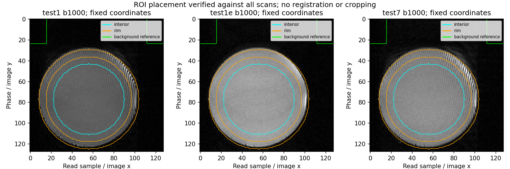

Alignment was checked visually and by the centroid of the largest b1000 region above 35% of its own maximum. All scans except test1 have centroids x=55.0–55.7, y=75.2–76.3 pixels; test1's fringes bias this threshold estimate to (53.9,74.2). The outlines remain aligned, and the interior ROI has substantial margin. The rim metric and pixelwise differences are more sensitive to subpixel boundary weighting; no difference image is interpreted as a pure biological change. [Centroid measurements](data/oct05_alignment.csv) and the [fixed masks](data/oct05_roi_masks.npz) are saved.

Interior signal is the mean magnitude, reported both absolutely and divided by the scan's b0 mean. Fine-texture measurement is RMS of image minus a Gaussian-smoothed copy (σ=2 pixels), divided by interior mean. It detects fringes but also noise; lower values are not a general image-quality score, and coil shading/large arcs remain separately visible. No SNR or significance test is reported. Pixels, echoes and k-space lines are not independent repeated scanner experiments.

Raw navigator line L2 norms measure echo magnitude without phase encoding or image reconstruction. They can include unwanted contributions, so late-echo retention is not pure primary-spin-echo retention. At high b, the readout-edge excess is

`sqrt(max(sum(|raw|² over samples 0:11 and 116:127) − 24 × estimated noise power, 0))`.

Noise power is approximated from the median squared magnitude over samples 16:47 and80:111 across that navigator train, divided by ln2, the complex Gaussian noise-power convention. The center window is samples 56:72, with analogous subtraction. Real off-center signal can contaminate the reference windows and make this conservative or biased. Zero clipped excess means unresolved excess, not proof of zero signal. The clearly large bursts remain visible without subtraction. Image magnitude has a positive noise floor: neither high-b ROI magnitude nor E1-normalized high-b echo growth is a trustworthy diffusion measurement here.

## Crusher-area audit before interpreting schedules

The available independent-crusher implementation plays **two same-polarity secondary-gradient lobes per RF**, separated by a primary slice-selective RF-gradient lobe. Each secondary lobe has ramp-up, a crusher plateau `tcrush` (or first-DWI `diff_tcrush`), and ramp-down. Stored `tramp=200 µs`; both ideal linear ramps together contribute one ramp-duration of area:

\[
A_i=a_i(t_i+200\ \mu s),\qquad A_{\mathrm{pair},i}=2A_i.
\]

This audit integrates the conditional commanded crusher trapezoids rather than multiplying baseline amplitude by the nominal plateau alone. The RF-gradient area and other imaging/diffusion gradients are excluded from this **crusher-component table**, and must be included in a full pathway calculation. Independent-mode RF padding extends timing around the primary lobe; it is not additional crusher plateau. Numeric hardware ramp samples and played v1.8 traces are not available, so exact samplewise or measured physical waveform areas cannot be claimed.

For RF index i=0…7, v1.7 uses the first-DWI baseline at i=0, even at nominal b0, and the train baseline otherwise. Increasing train factors are 100/140/180/220/260/300/340%; decreasing reverses those seven factors while retaining the first-DWI baseline. Alternation reverses the sign at i=1,3,5,7. Custom entries are multiplied by the first or train baseline as appropriate; the first percentage appears on the array header and is included. Positive magnitudes are rounded half up with `(abs(base)*abs(pct)+50)//100`, then signed. The source **aborts** on amplitude/slew ceiling violations; it does not clamp. None of today's independent schedules exceeds those limits in this model: the largest commanded magnitude is 19863 DAC, below32767; ramp200 µs also meets the stored slew ceiling32767 DAC/100 µs. A larger stored limit does not constitute measured hardware slew performance.

The concise table includes both lobes of all eight RF pairs, including the first-DWI pair. Values are in **10⁶ DAC·µs**; identical PE variants share areas.

| Scan(s) | Schedule | First pair absolute area | Subsequent seven pairs absolute area | All-pair signed sum | All-pair absolute sum |
|---|---|---:|---:|---:|---:|
| test0 (ETL1) | positive constant | 13.157 | 0 | +13.157 | 13.157 |
| test1 | positive constant | 13.157 | 46.049 | +59.206 | 59.206 |
| test1e/f/g | negative constant | 13.157 | 46.049 | −59.206 | 59.206 |
| test1b | positive constant, 2 ms | 12.060 | 84.423 | +96.483 | 96.483 |
| test1c | negative constant, 2 ms | 12.060 | 84.423 | −96.483 | 96.483 |
| test1d | negative constant, 2 ms, double baseline | 24.121 | 168.846 | −192.966 | 192.966 |
| test2 | positive increasing | 13.157 | 101.306 | +114.463 | 114.463 |
| test2b/c/d | negative increasing | 13.157 | 101.306 | −114.463 | 114.463 |
| test3 | positive increasing + alternating | 13.157 | 101.306 | −1.318 | 114.463 |
| test3b | negative increasing + alternating | 13.157 | 101.306 | +1.318 | 114.463 |
| test4 | strong negative decreasing | 13.157 | 202.615 | −215.772 | 215.772 |
| test4b | stronger decreasing, longer first | 25.705 | 215.921 | −241.626 | 241.626 |
| test5 | negative decreasing | 13.157 | 101.306 | −114.463 | 114.463 |
| test6 | negative custom | 13.157 | 66.046 | −79.202 | 79.202 |
| test7 | alternating custom | 13.157 | 66.046 | −1.975 | 79.202 |

Legacy testa is excluded from this independent-component table: its coupled crusher/slice-select geometry cannot be represented by the missing independent amplitude fields. Missing controls do not mean zero crushers. See the [per-echo areas](data/oct05_crusher_echo_areas.csv), [train totals](data/oct05_crusher_train_areas.csv), [calculation and assumptions](data/oct05_crusher_area.json), and [reproducible area code](data/oct05_crusher_area.py).

The embedded calibration convention is `grad_var[0]=25447 Hz/mm` at full logical DAC 32767, as explicitly used by the predecessor's diffusion calculation. With proton γ/2π≈42.577 MHz/T this gives a **nominal 0.01824 mT/m per logical DAC**; 5482 DAC is about 100 mT/m. Multiply DAC·µs by approximately 1.824×10⁻⁵ for mT·ms/m. Thus the test1e all-pair absolute total is nominally1080 mT·ms/m; test2b is 2088 and test6 is 1445. These are calibrated-command estimates under the embedded convention, not field-probe validation. Orientation matrix rounding, gradient response, ramp discretization and v1.8 equivalence limit their accuracy. DAC·µs remains the primary audit unit.

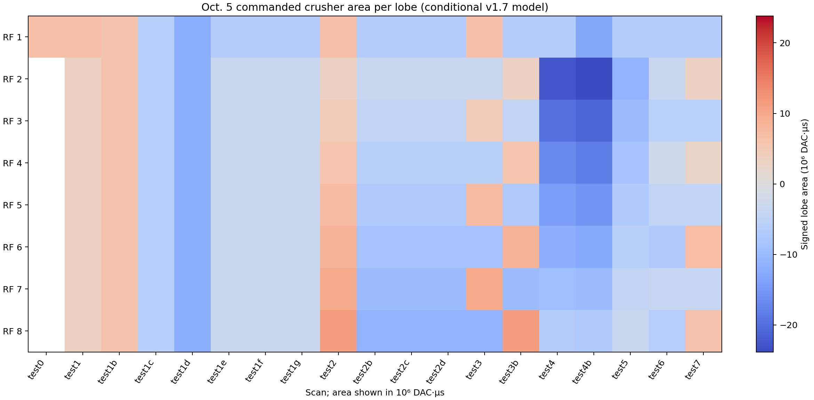

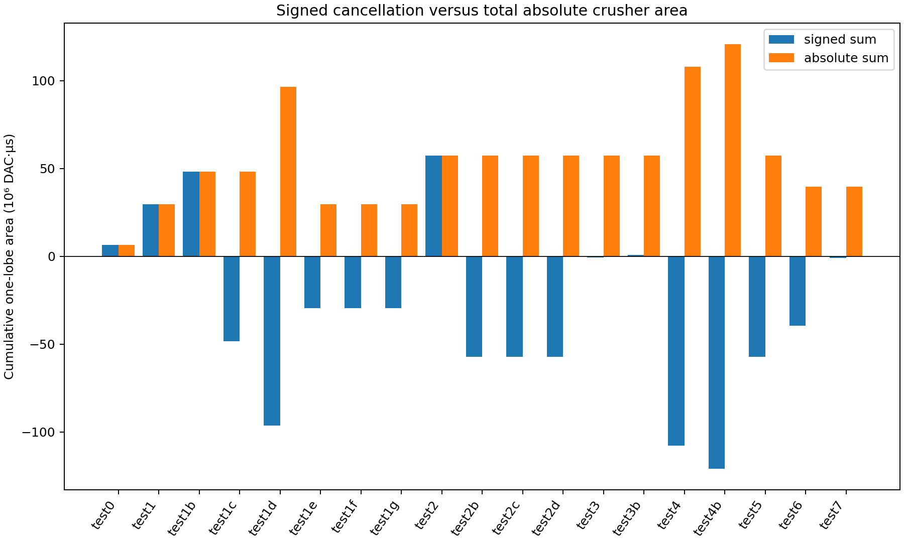

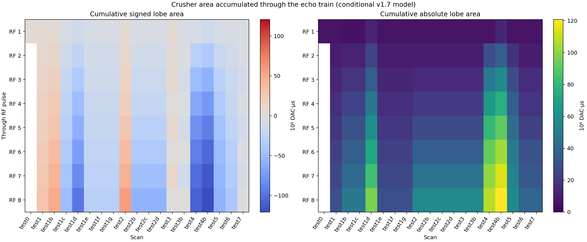

The area figures show one lobe per RF; the two-lobe pair values in the table and CSVs are twice these values. White cells for test0 after RF1 mean no subsequent echoes, not zero-area train crushers.

Two comparisons isolate sign at equal absolute area per echo: test1↔test1e and test1b↔test1c. Test2↔test2b and test3↔test3b reverse the whole schedule at equal absolute area. Test2↔test3, test2b↔test3b and test6↔test7 alter sign on selected echoes at equal absolute area. **Test2b↔test5 has the same first pair, same total area and same multiset of subsequent areas, reversed in time**; it is the strongest schedule-order comparison. Equal totals alone would not establish equal diffusion weighting.

By contrast, constant↔increasing changes the total by 93.3%; custom has33.8% more than constant but30.8% less than increasing; strong↔weak decreasing changes the total by 88.5%. Test4b further changes baseline and first duration. Test1b's first lobe is 8.3% smaller than test1's despite the apparent amplitude-duration compensation, while its subsequent lobes are 83.3% larger; its total is 63.0% greater and ESP changes. These are **not matched-area acquisitions**. No post hoc normalization of a calculated area is treated as an experimental control.

For an ideal primary spin echo, RF refocusing reverses the phase accumulated before RF: equal same-sign lobes can give zero RF-sign-weighted net moment at the echo while strongly dephasing other pathways. Across RF pulses, magnetization can occupy positive transverse, negative transverse, or longitudinal states. Each pathway therefore sees different signed gradient history; longitudinal storage and imperfect flips matter. A simple raw signed sum ignores RF, and an absolute sum ignores cancellations relevant to each pathway. This is why neither sum predicts suppression on its own. The [extended-phase-graph description](https://doi.org/10.1002/jmri.24619) provides the general framework; the specific pathway responsible for today's bursts has not been identified.

## Crusher findings from images and raw echoes

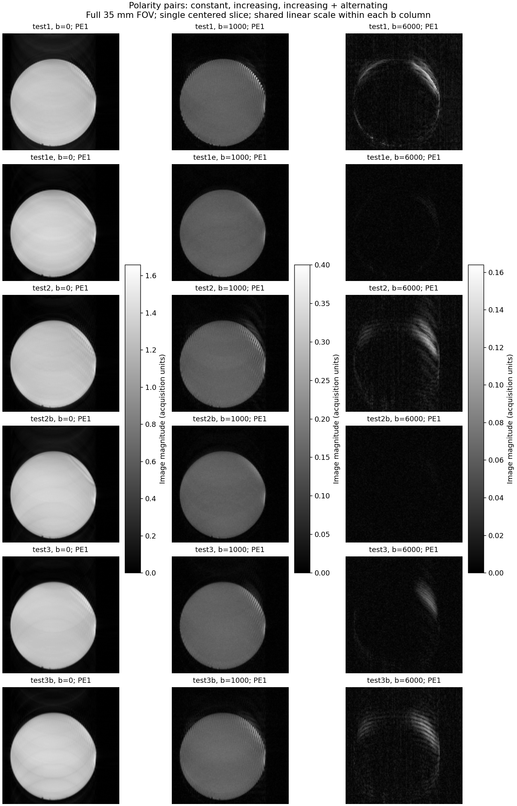

The quantitative anchors below use the fixed regions and one common reconstruction. Image values are acquisition units at RX30; raw edge excess is approximate excess L2 units. “Texture” is the b1000 interior high-pass RMS divided by mean, expressed as a percent. It includes noise and is not an SNR measure.

| Scan | Interior b0 | Interior b1000 | b1000/b0 | Texture (%) | High-b rim mean | High-b background mean | High-b raw E2 edge excess | b1000 raw E8/E1 |
|---|---:|---:|---:|---:|---:|---:|---:|---:|
| test1 | 1.269 | 0.1481 | 0.1167 | 3.14 | 0.02234 | 0.00877 | 74.24 | 0.809 |
| test1e | 1.335 | 0.1472 | 0.1103 | 2.40 | 0.00582 | 0.00423 | 5.75 | 0.808 |
| test1b | 1.304 | 0.1527 | 0.1171 | 2.41 | 0.01097 | 0.00446 | 15.92 | 0.778 |
| test1c | 1.287 | 0.1498 | 0.1164 | 2.31 | 0.00437 | 0.00421 | 0.00 | 0.757 |
| test1d | 1.311 | 0.1478 | 0.1127 | 2.32 | 0.00443 | 0.00420 | 1.23 | 0.639 |
| test2 | 1.271 | 0.1500 | 0.1180 | 3.45 | 0.02049 | 0.00659 | 75.44 | 0.626 |
| test2b | 1.325 | 0.1482 | 0.1118 | 2.41 | 0.00491 | 0.00425 | 4.98 | 0.598 |
| test3 | 1.285 | 0.1523 | 0.1185 | 2.52 | 0.01106 | 0.00471 | 4.97 | 0.464 |
| test3b | 1.323 | 0.1553 | 0.1174 | 3.19 | 0.01930 | 0.00627 | 76.63 | 0.487 |
| test4 | 1.230 | 0.1557 | 0.1265 | 2.32 | 0.00444 | 0.00428 | 1.03 | 0.480 |
| test4b | 1.238 | 0.1483 | 0.1198 | 2.36 | 0.00430 | 0.00430 | 0.96 | 0.494 |
| test5 | 1.304 | 0.1455 | 0.1116 | 2.40 | 0.00450 | 0.00406 | 0.00 | 0.601 |
| test6 | 1.329 | 0.1534 | 0.1154 | 2.27 | 0.00540 | 0.00423 | 4.89 | 0.457 |
| test7 | 1.314 | 0.1530 | 0.1165 | 3.18 | 0.01930 | 0.00604 | 74.42 | 0.384 |

The [full measurement table](data/oct05_image_measurements.csv) also includes navigator-off and magnitude-only correction results, medians, background RMS and rim percentiles. These single-run differences are descriptive; their decimal precision does not imply repeatability.

### Sign reversal suppresses contamination without a large b1000 signal loss

Test1→test1e reduces the high-b rim mean by 74% and E2 edge excess by 92%, while b1000 interior mean changes by −0.6% and E8/E1 is essentially unchanged. Test2→test2b reduces the rim mean by 76% and E2 edge excess by 93%, with b1000 mean −1.2%. Test1b→test1c reduces the rim mean by 60%, while b1000 mean changes −1.9%. The matching per-echo absolute area and all other recorded sequence controls make polarity a substantially better explanation than “more crushing.” Unrecorded scanner drift remains possible; observing the effect under both durations and increasing schedules strengthens attribution without constituting independent repeats.

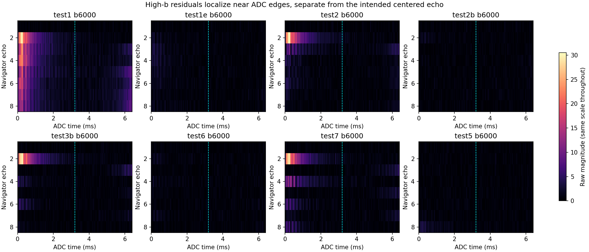

The large high-b signals peak at ADC edges rather than around sample 64, the intended echo center at about 3.2 ms. This supports unwanted-coherence or transient contamination rather than useful surviving diffusion signal. Magnitude/position alone cannot discriminate an unintended spin/stimulated echo, RF-related FID, eddy-current effect or electronic transient. Polarity dependence is consistent with changed interactions with fixed slice/read/phase gradients and alternative pathways; it does not prove a particular mechanism.

### Increasing and alternating schedules have a sign-dependent trade-off

Positive constant→increasing (test1→test2) reduces late E8 edge excess from 40.9 to 6.3 but leaves the strong E2 burst (74.2→75.4); rim contamination persists. It simultaneously increases total area by 93%, and lowers b1000 navigator E8/E1 from 0.809 to 0.626. This demonstrates a changed echo history, not a shape-only benefit.

Negative constant→increasing (test1e→test2b) improves the small residual rim (0.00582→0.00491), but its late b1000 retention falls 0.808→0.598. The modest image advantage does not clearly justify the greater area and changed late-echo signal for quantitative diffusion.

Adding alternation to the positive increasing train (test2→test3) reduces E2 edge excess 75.4→5.0 and rim 0.02049→0.01106 at **equal absolute area per echo**. Late signal falls 0.626→0.464, and some residual arcs remain. Starting from the negative baseline reverses the outcome: test2b→test3b restores E2 edge excess 4.98→76.63, increases rim 0.00491→0.01930 and raises b1000 texture2.41%→3.19%, with late retention 0.598→0.487. At E2, the alternating negative-baseline train actually plays a **positive** crusher, whereas negative increasing plays a negative one. This coincidence with the large burst is measured; whether that sign creates a particular refocused unwanted pathway is a hypothesis.

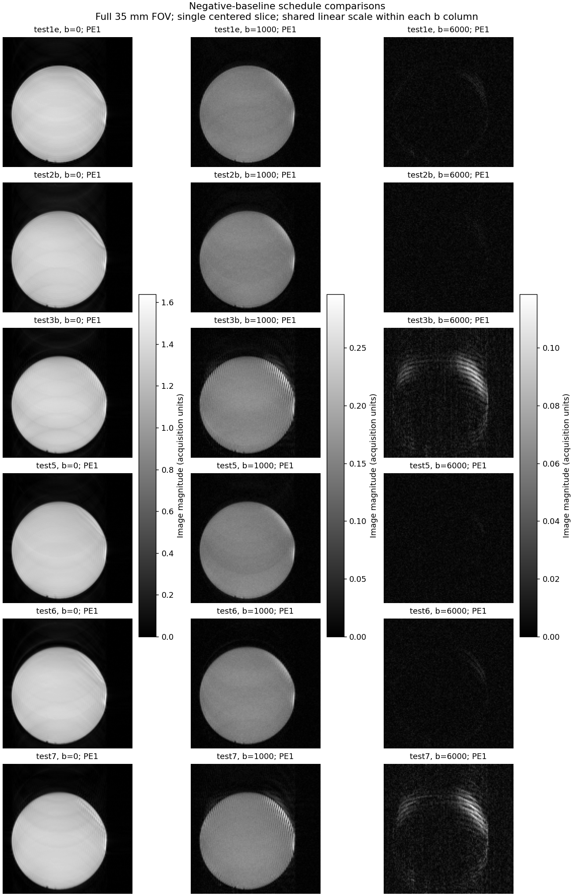

### Decreasing schedules redistribute area; the stronger version adds area

Negative increasing test2b and decreasing test5 have identical first-DWI crushers, the same absolute total and the same seven subsequent lobe magnitudes in reverse order. Both high-b images are mostly noise-like. Decreasing strongly suppresses early residuals but has a late E8 edge excess 9.6 compared with1.7 for increasing; b1000 E8/E1 is nearly identical (0.601 versus0.598). This is evidence that **area distribution across echoes changes where residual contamination appears**, rather than a clear quality winner.

Test4 doubles the train baseline relative to test5, with unchanged first crusher. Its total grows88.5%, and late high-b E8 excess falls 9.6→2.4. Both rim means are near their backgrounds, so a large image-level benefit is not established; late b1000 retention falls 0.601→0.480 and b0 mean falls 1.304→1.230. Larger early area may suppress unwanted signal and/or change other pathway weights, but lower baseline signal can raise b1000/b0 even without improved diffusion performance. Test4's ratio0.1265 should therefore not be called “better diffusion signal.”

Test4b changes both baseline (−5482→−5842) and first duration (1→2 ms), increasing total area another12.0%. Its high-b image remains at background levels, b1000 mean falls 0.1557→0.1483, and E8/E1 is 0.494. There is no convincing additional quality gain attributable to either changed factor separately.

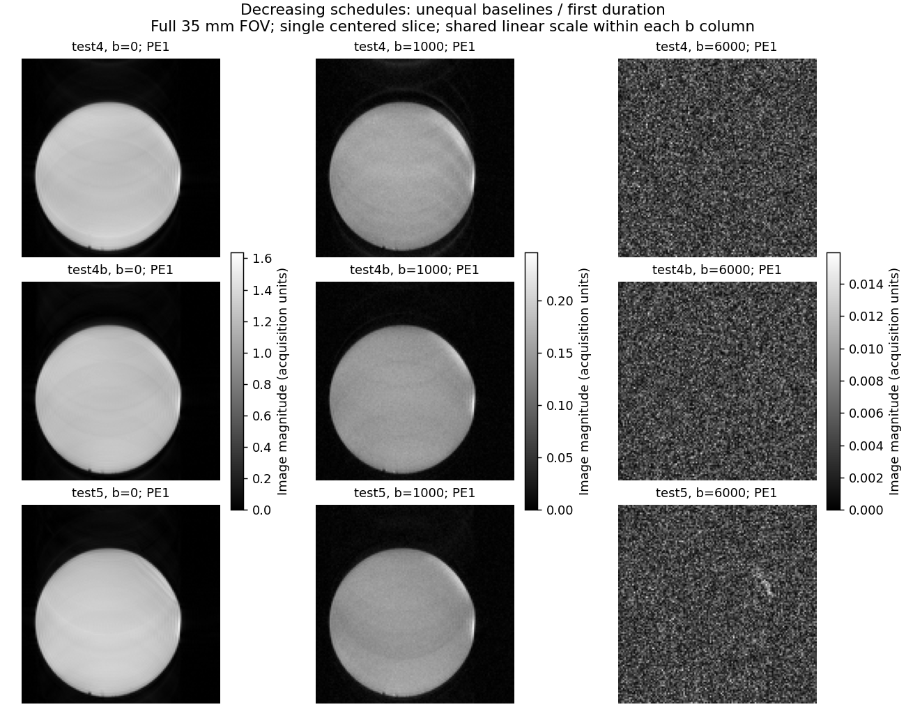

### The custom pair is a particularly informative equal-area sign test

The nonalternating custom amplitudes are `[-5482,-2741,-4687,-2275,-3755,-5838,-2988,-5235]`; test7 changes the even-RF signs to positive. Both have all-pair absolute area 79.202×10⁶ DAC·µs. Test7's raw signed total is only−1.975×10⁶, yet its E2 edge excess is 74.42 versus4.89 for test6, and its high-b rim mean is 0.01930 versus0.00540. The b1000 interior means are almost identical (0.15305 versus0.15338), so the residual improvement is not merely global dimming. Its texture rises 2.27%→3.18% and late b1000 retention falls 0.457→0.384.

The two schedules have identical absolute strength at every echo, including the weaker E4 and E7 lobes. Those local weaknesses do not alone explain their difference. The sign pattern changes which moments may cancel after intervening RF pulses; it can favor or suppress different unwanted pathways. This is a plausible EPG interpretation, not a verified pathway simulation of the scanner. Test6 also differs in amplitude distribution and total from constant or increasing schedules, so it is not an area-matched test of a random/nonmonotonic shape against them.

### Duration and amplitude controls

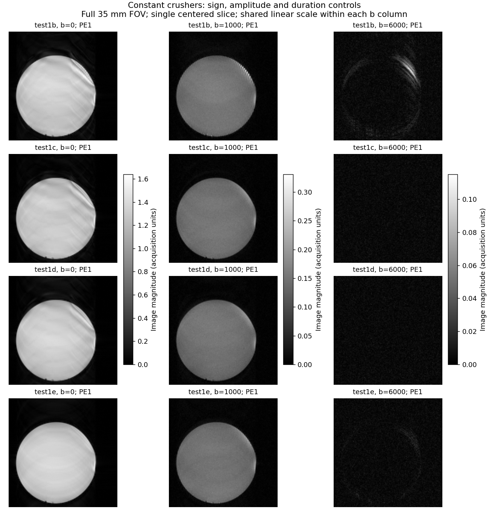

Positive test1b improves on test1's high-b rim, but changes ESP, first amplitude, and both durations, giving63% more total area. The result cannot isolate duration. Sign reversal test1b→test1c is cleaner and more informative. Doubling the negative amplitude test1c→test1d doubles area while leaving the high-b rim at background level; b1000 mean decreases slightly and E8/E1 drops0.757→0.639. The larger area has not shown a practical quality advantage. Negative test1c versus shorter test1e changes first/train amplitude-duration balance and ESP; the near match of their **first** lobe areas does not match the whole train or timing.

## Diffusion attenuation and effective b-value limitations

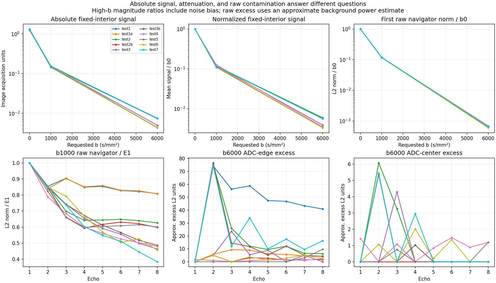

The raw first-navigator b1000/b0 norm ratio is 0.1158–0.1185 for the ETL8 v1.8 scans, despite the large differences in high-b artifacts and later echo retention. Taking `−ln(ratio)/1000` gives a descriptive apparent diffusivity near 0.00213–0.00216 mm²/s. If the specimen is water and a monoexponential model remains valid, extending that attenuation to b6000 gives approximately 2.4–2.8×10⁻⁶ of b0. The first b6000 navigator norms are 6.5–7.8 acquisition units versus about 10445–10833 at b0; that remaining L2 floor is much larger than the extrapolated primary signal. This calculation explains why high-b magnitude should be interpreted chiefly as a contamination/noise test. It is not calibrated diffusometry or a fitted high-b ADC.

**Effective b-values cannot be reliably assigned from the supplied files.** Requested b arrays and JSON/bval sidecars describe the diffusion input. The available predecessor models finite diffusion ramps and integer DAC/calibration conversion; it does not include the full crusher, slice-selection, readout and PE histories in a pathway-specific measured b-tensor. The stored acquisition-gradient array is not an independently logged played waveform in b-input mode. Missing v1.8 source/executable, actual gradient response/timing, and RF-pathway history prevent a reliable all-gradient calculation.

For a specified ideal primary pathway, define the accumulated phase gradient as `q(t)=γ∫f(t)G(t)dt`, where f changes sign at ideal refocusing pulses. The b-tensor is `B=∫q(t)q(t)ᵀdt`; scalar b is its trace. Splitting G into diffusion, crusher and imaging components creates self terms and cross terms. A pair can have zero final q and still add positive b because q was nonzero between lobes. Sign changes can alter cross terms. In the centered zero-angle prescription, logical slice crushers and read-axis diffusion are nominally orthogonal, so their direct ideal scalar cross term vanishes, but slice-gradient interactions, matrix response, imaging gradients, and unintended pathways remain relevant. The [primary b-matrix treatment](https://www.sciencedirect.com/science/article/pii/S106418588471103X) and [crusher/diffusion pathway study](https://onlinelibrary.wiley.com/doi/full/10.1002/mrm.24676) support these general mechanisms; they do not identify today's artifact.

Consequently, equal crusher area does not guarantee equal b, and nominal b0 need not be exactly zero total diffusion weighting. A reliable next calculation needs the actual complete waveform and RF timing, including the primary slice lobe, per-echo PE/readout gradients, and the selected coherence pathway. No invented “corrected b=…” values are substituted for the requested values here.

## Separate phase-encoding ordering analysis

The full embedded-record audit verifies that **test1e/f/g differ only in PE1/6/7** and that **test2b/c/d differ only in PE1/6/7**, excluding acquisition counters. They retain the same crusher schedules, amplitudes, timing, RF settings, geometry, gains, navigator and diffusion controls within each group. Comparing test1 directly with test1f or test1g would also change crusher polarity and is not an ordering-only comparison.

For N=128 imaging rows and L=8 echoes, there are S=16 imaging shots. With zero-based shot s, echo e and V=S/2=8, the supplied predecessor and reconstruction implement:

- PE1: ky=`s−V−V*e` for s<V, otherwise `s−V+V*e`; central rows occupy E1.
- PE6: the PE1 formula with e replaced by L−1−e; central rows occupy E8.
- PE7: ky=`−N/2+s+e*S`; each echo occupies one16-row band, from negative to positive ky, and ky=0 occupies E5.

Thus the echo time of ky=0 is 54 ms for PE1,152 ms for PE6, and110 ms for PE7 (54+(echo−1)×14 ms), **conditional on v1.8 retaining that table**. PE1's first central band spans ky−8…7; PE6 reverses the eight bands. PE7 puts ky−16…−1 at E4 and0…15 at E5, so the two sides of the center are weighted at different echo times. This is a contrast and point-spread-function change, not simply a permutation with identical weighting.

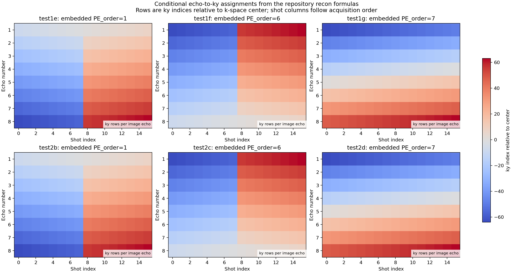

The current reconstruction explicitly supports1/6/7 and rejects unsupported settings; there is no silent fallback. It uses |ky| envelope interpolation for PE1/6 and signed ky for PE7. The independently implemented [PE replay](data/oct05_pe_analysis.py) reproduces all18 saved volumes in the two groups. Agreement verifies the saved-image mapping/correction convention, not the played v1.8 gradient order.

| Group / scan | PE order | Interior b0 | Interior b1000 | b1000/b0 | Raw first b1000/b0 | b1000 texture (%) |
|---|---:|---:|---:|---:|---:|---:|
| constant / test1e | 1 | 1.335 | 0.1472 | 0.1103 | 0.1176 | 2.40 |
| constant / test1f | 6 | 1.055 | 0.1219 | 0.1155 | 0.1172 | 2.86 |
| constant / test1g | 7 | 1.134 | 0.1312 | 0.1157 | 0.1171 | 2.68 |
| increasing / test2b | 1 | 1.325 | 0.1482 | 0.1118 | 0.1170 | 2.41 |
| increasing / test2c | 6 | 0.7637 | 0.08738 | 0.1144 | 0.1178 | 3.97 |
| increasing / test2d | 7 | 0.7913 | 0.09114 | 0.1152 | 0.1183 | 3.85 |

At constant crushing, PE6 reduces b0/b1000 interior means by 20.9%/17.2% versus PE1; PE7 reduces them15.1%/10.9%. At increasing crushing, reductions are 42.3%/41.0% for PE6 and40.3%/38.5% for PE7. This is consistent with later central-k-space acquisition sampling a more attenuated echo train, especially under increasing crushers. Raw b1000 E8/E1 is 0.808/0.797/0.794 in the constant group and0.598/0.591/0.589 in the increasing group: changing PE does not appreciably rescue the underlying unencoded navigator envelope.

All six high-b interiors remain near the magnitude floor, with means 0.0043–0.0045. The constant group has small residual rims under all orders; increasing remains relatively clean. These negative-baseline tests do not determine whether PE6/7 would reduce the large positive-crusher burst or merely relocate its artifacts. No ordering-only positive-crusher group was acquired.

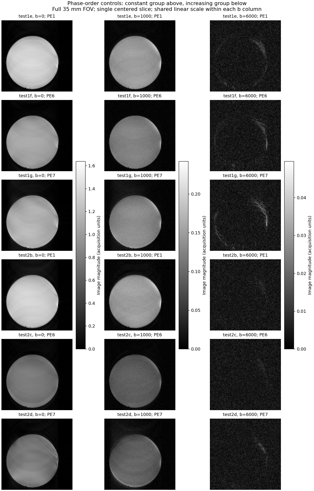

Reverse centric displays broad ring/contrast changes; linear interleaved displays asymmetric bands/edge weighting. The lower signal makes the relative high-pass metric larger and cannot be interpreted as a pure increase in ghosts. Neither method has established sharper resolution or better diffusion accuracy. Unequal echo weighting can change contrast, blur boundaries and produce ringing; an apparent improved normalized ratio can coexist with substantial absolute-signal loss. No T2-only correction is assumed because navigator decay includes RF/pathway effects.

The stronger brightness effect in the increasing group is **supported descriptive interaction** between schedule-dependent echo attenuation and PE weighting. It is not a randomized factorial interaction estimate: group acquisition times differ and no repeats quantify drift.

## K-space comparisons before reconstruction

The following panels show **complex imaging ADC data reordered into the centered ky table**, with the navigator train excluded, before correction or inverse Fourier transformation. They are not Fourier transforms of magnitude images. The horizontal axis retains readout sample indices; sample 64 is the intended echo center. The vertical axis is the reconstructed ky row relative to center, conditional on the same predecessor mapping described above, rather than independently verified played gradients. Neither axis is a calibrated physical k-space coordinate.

Each focused montage uses `log10(1 + |K| / 1 acquisition unit)` with the same additive offset and color limits for all scans within each b column. No per-scan normalization is used. The logarithm reveals faint bands while retaining absolute magnitude differences; scales vary across b columns and across separate figures. Test0's unequal receiver gain remains a confound in its contact sheet.

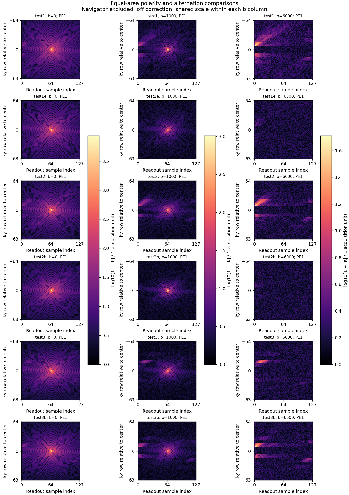

The positive constant and increasing scans show bright readout-edge wedges and echo-dependent ky bands at b6000. Sign reversal strongly suppresses these structures. The negative-baseline alternating test3b restores them. The **uncorrected imaging data**, as well as the unencoded navigators, therefore support a polarity-dependent acquired contribution. A bright high-b band away from the intended readout center is not evidence of useful primary diffusion signal. Its magnitude and location still cannot identify a unique coherence pathway or hardware transient.

For a quantitative comparison, readout-edge power is the sum of squared complex magnitude over samples 0–11 and 116–127, across all 128 imaging rows, divided by total imaging power. Total L2 is the square root of total power in acquisition units. These measurements **retain noise power** and do not use the navigator noise subtraction. Uniform independent noise would put 18.75% of its expected power in this 24-of-128-sample window; a value near that fraction does not establish artifact-free data or SNR.

| Scan | Edge power b1000 (%) | Edge power b6000 (%) | Total L2 b6000 |
|---|---:|---:|---:|
| test1 | 1.704 | 65.071 | 266.10 |
| test1e | 0.119 | 22.112 | 87.04 |
| test2 | 1.633 | 61.413 | 257.06 |
| test2b | 0.097 | 21.017 | 82.74 |
| test3b | 1.861 | 77.702 | 244.54 |
| test6 | 0.096 | 20.986 | 85.95 |
| test7 | 1.632 | 74.790 | 243.16 |

At b1000, the edge contribution is small relative to the strong centered echo, yet rises substantially in the contaminated protocols. At b6000, it dominates test1/test2/test3b/test7, while negative nonalternating controls approach a much more broadly distributed floor. The test6/test7 custom pair again separates sign effects at identical per-echo absolute crusher area: the large difference is visible in raw imaging data and does not depend on navigator correction.

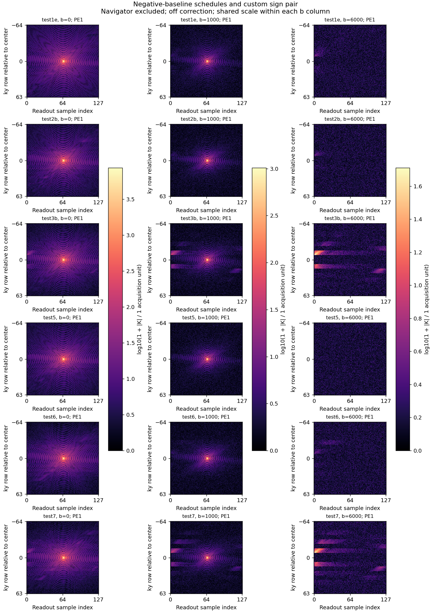

The [constant duration/amplitude comparison](figures/physical_scanner_2026-10-05/kspace_duration_amplitude.png) and [decreasing-schedule comparison](figures/physical_scanner_2026-10-05/kspace_decreasing.png) provide the corresponding raw-data view of those controls. As with the images, their unequal timing or area must be considered before attributing differences to schedule shape.

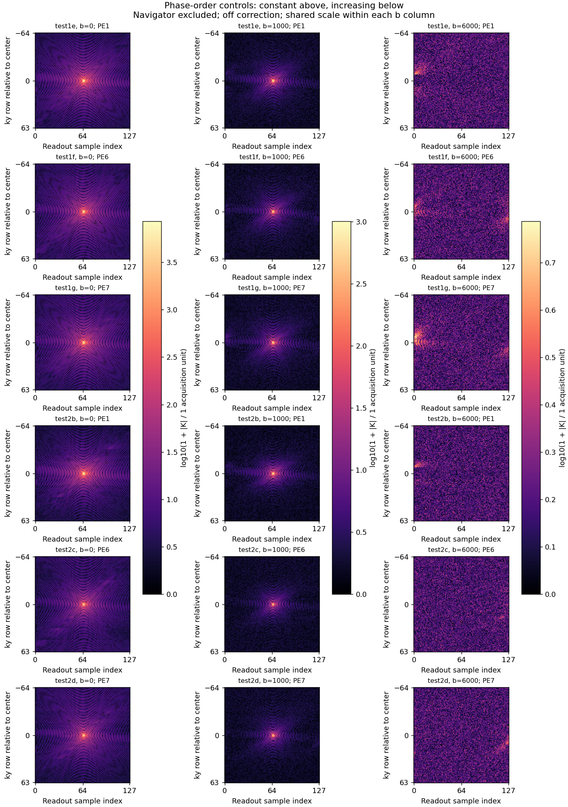

The PE groups show weaker b1000 central structure with PE6/7, especially with increasing crushers. Uncorrected total imaging L2 is 81.8%/88.4% of PE1 for constant PE6/7, and 58.5%/62.5% for increasing PE6/7. A digital row permutation preserves total power within a scan, so these between-acquisition differences already exist in the acquired samples. They are consistent with different echo weighting at central ky, rather than a brightness loss created solely by navigator correction. Drift and the missing played-gradient record still limit causal attribution. K-space magnitude alone cannot assess phase coherence or predict the exact ghost pattern.

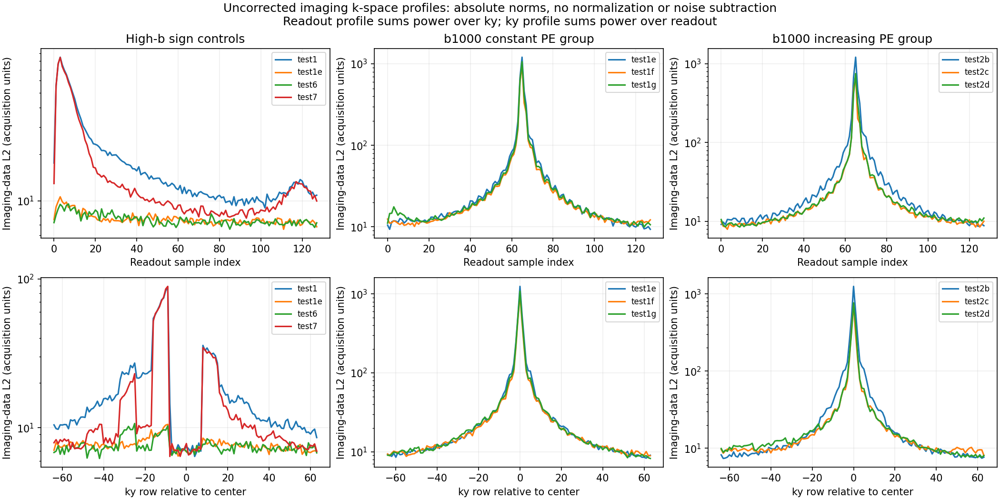

The readout profiles sum power across ky and take its square root; the ky profiles do the same across readout. They retain absolute acquisition units on a logarithmic vertical scale, without normalization or noise subtraction. They separate the pronounced high-b edge contribution from the central signal loss in the PE groups.

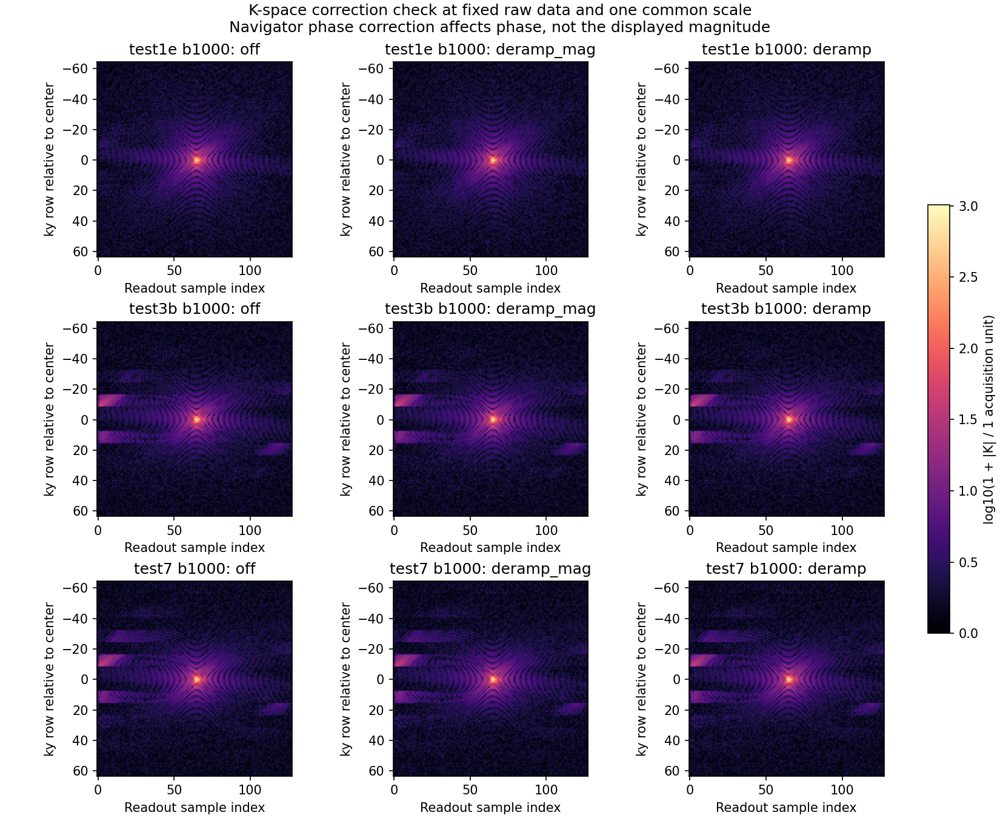

At fixed raw data, magnitude deramp changes row weights, while adding navigator phase correction leaves k-space magnitude unchanged by construction. The edge structures remain visible with correction off. Identical magnitude-only and magnitude-plus-phase panels do not imply identical reconstructed images: phase affects interference after Fourier transformation.

All 20 scans and all three b-values are included in the k-space contact sheets: [test0 through test1d](figures/physical_scanner_2026-10-05/kspace_all_scans_1.png), [test1e through test2b](figures/physical_scanner_2026-10-05/kspace_all_scans_2.png), [test2c through test4](figures/physical_scanner_2026-10-05/kspace_all_scans_3.png), and [test4b through legacy testa](figures/physical_scanner_2026-10-05/kspace_all_scans_4.png). The [k-space measurement table](data/oct05_kspace_measurements.csv) contains 120 records covering correction off and full deramp for 20 scans × 3 b-values, including central-readout and central-ky power fractions. The latter depend on the conditional ky mapping.

## Reconstruction check and complete visual record

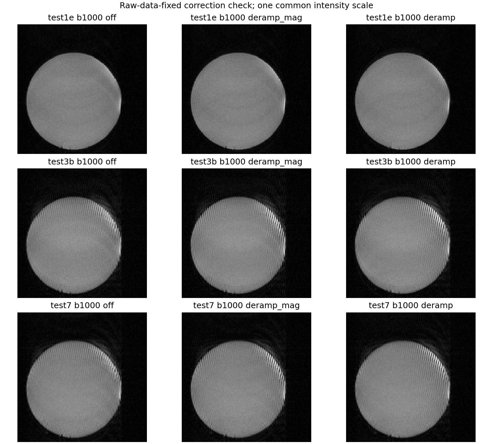

Holding each MRD fixed and reconstructing without correction, with magnitude deramp only, and with deramp plus phase shows that the test3b/test7 fringes remain before correction. Navigator correction slightly redistributes signal but does not create the major polarity-dependent contamination. For the strongest polarity/custom pairs, raw evidence supports the conclusion independently of reconstruction. The current single-scalar navigator correction is not a pathway separator, and phase estimates at near-noise high b are unstable.

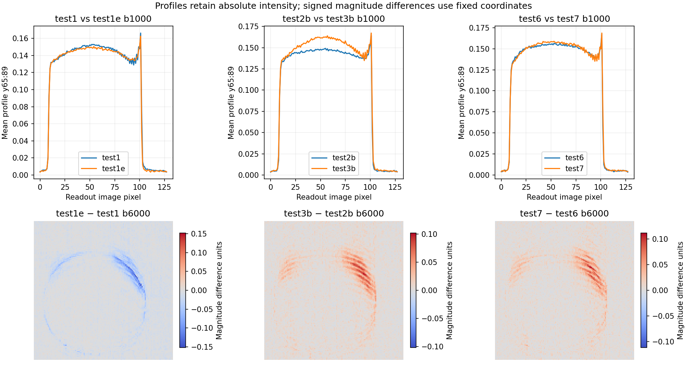

The profiles use the identical y65:89 strip and retain absolute signal. High-b signed magnitude differences show where residual structure is removed or added, using fixed coordinates and symmetric diverging scales. They are descriptive and include noise; boundary alignment and magnitude bias limit interpretation.

Every scan and b-value is shown in the shared-scale contact sheets: [test0 through test1d](figures/physical_scanner_2026-10-05/all_scans_1.png), [test1e through test2b](figures/physical_scanner_2026-10-05/all_scans_2.png), [test2c through test4](figures/physical_scanner_2026-10-05/all_scans_3.png), and [test4b through legacy testa](figures/physical_scanner_2026-10-05/all_scans_4.png). Test0's smooth b1000 outline is interesting, but ETL1, navigator absence and gain changes prevent a crusher-specific conclusion. Legacy testa has strong b0 arcs, a smooth b1000 interior and noise-like high b; legacy RF/gradient geometry, Δ and ESP prevent attributing that behavior to crushers alone.

## Reproduction and verification

From the repository root, run:

```text
python docs/data/oct05_protocol_audit.py
python docs/data/oct05_update_catalog.py
python docs/data/oct05_crusher_area.py
python docs/data/oct05_pe_analysis.py
python docs/data/physical_scanner_analysis_2026-10-05.py
python docs/data/verify_physical_scanner_2026-10-05.py
```

To regenerate only the k-space figures and measurements while retaining existing image figures, run `python docs/data/physical_scanner_analysis_2026-10-05.py --kspace-only`. K-space checks verify all 120 measurement records against the complex data, conservation of power under row permutation, and Parseval consistency with the reconstructed images.

The scripts read original scanner files and write only derived figures/tables under `docs`. Measurements, source hashes, NIfTI errors, raw echo windows, fixed ROI coordinates and alignment checks are in the [main analysis JSON](data/physical_scanner_analysis_2026-10-05.json); the [main analysis code](data/physical_scanner_analysis_2026-10-05.py) regenerates every image measurement. Original data and unrelated existing work were preserved. Integration checks cover scan identities, all18 NIfTI matches, area arithmetic, paired area equalities, gain controls and report links; physical v1.8 waveform/b-value verification remains unavailable for the stated provenance reasons.

## Next scanner experiments, in priority order

1. **Archive and verify v1.8 provenance first.** Save the actual PPL, all referenced RF/gradient libraries, executable/build hash, compiled gradient/RF/ADC listing and per-scan embedded protocol. Acquire a gradient timing/readback trace where available. This enables actual samplewise area and complete per-echo b-tensor calculation.
2. **Repeat the strongest sign controls in randomized/interleaved order.** Repeat test1/test1e and test6/test7 at fixed RX/TX settings, specimen placement and temperature. Include a return to the initial protocol after each pair. Capture raw navigators and explicit receiver-noise reference data; examine burst positions and complex phase, not only magnitude images.
3. **Acquire constant/increasing/decreasing/custom schedules with matched total absolute area and matched timing**, keeping the first-DWI pair identical. Test2b/test5 is an existing template for matched-area reversed ordering. Choose the subsequent baseline/custom factors prospectively to match the area, save the rounded per-echo DAC table, and verify playback. Include separate controls that match the per-echo absolute areas while changing signs. A matched total still allows different b and pathway moments; calculate those from the verified full waveform.
4. **Separate duration from amplitude and ESP.** Hold ESP fixed at a feasible common value, preserve first and subsequent areas separately by ramp-inclusive calculation, and vary plateau duration/amplitude. Do not use simple nominal amplitude×duration matching. Compare moderate negative constant area with doubled area to test whether the latter adds any repeatable benefit beyond the background floor.
5. **Repeat both PE groups as a factorial control with fixed crushers**, including a positive-crusher group if the question is artifact redistribution. Preserve navigator correction settings and display scale; measure absolute b0/b1000 signal, attenuation, boundary profiles and raw echoes. Add a point/edge phantom if blurring is a primary question, rather than inferring resolution from a uniform circular specimen.
6. **Use intermediate b-values with measurable primary signal.** Add several between0 and1000–2000 s/mm², depending on the specimen, with diffusion-direction reversal as a cross-term/eddy-current control. Keep b6000 as an unwanted-signal stress test. Use the verified complete waveform to distinguish requested diffusion b from effective pathway-specific b, and record temperature if water diffusivity is used as a calibration check.

The current evidence prioritizes negative nonalternating crushers and controlled per-echo area/sign experiments. It does not establish a universal best schedule, a calibrated diffusivity, or a phase order that simultaneously improves signal, contrast and artifacts.

