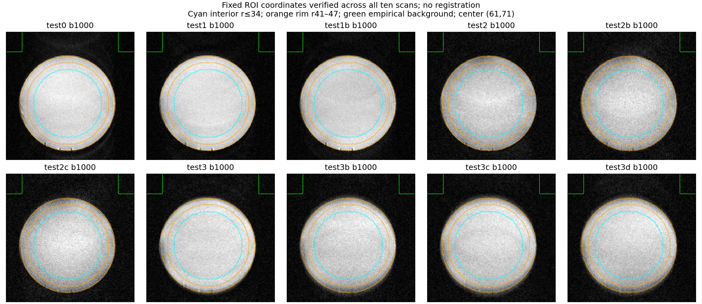
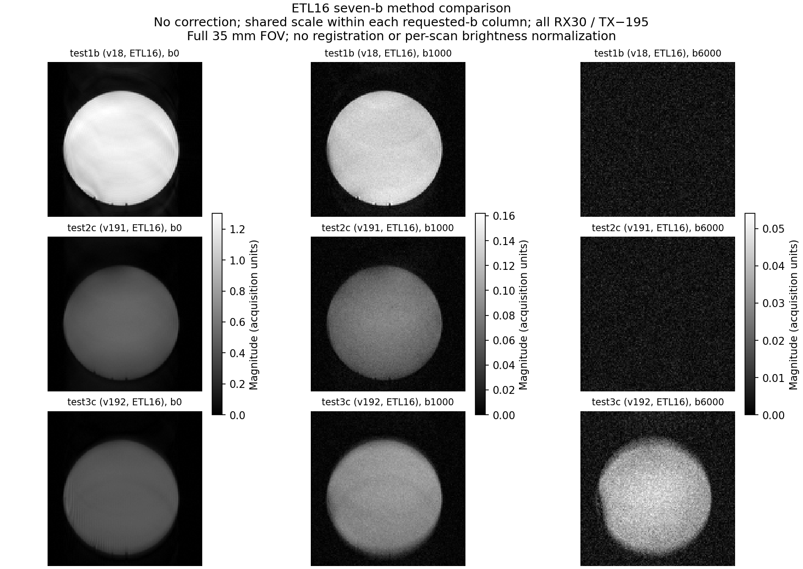
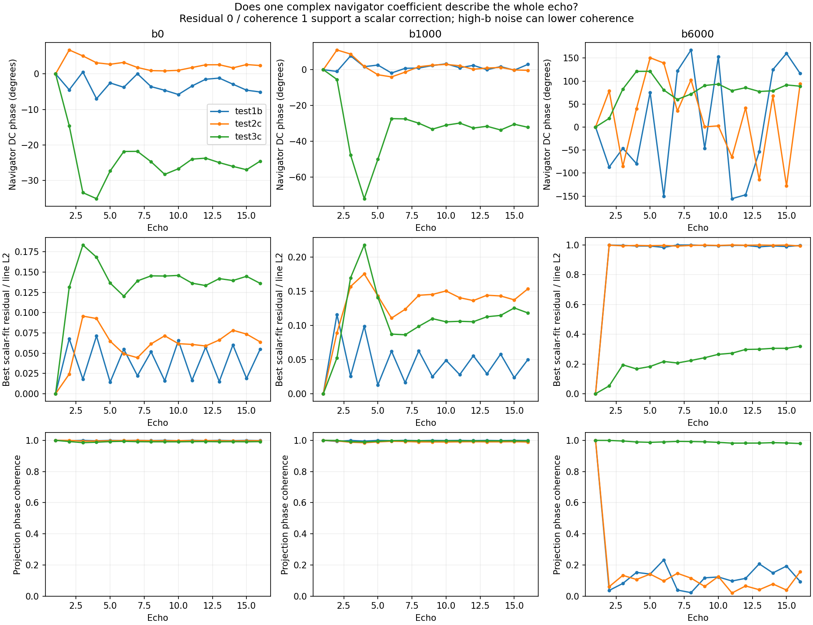
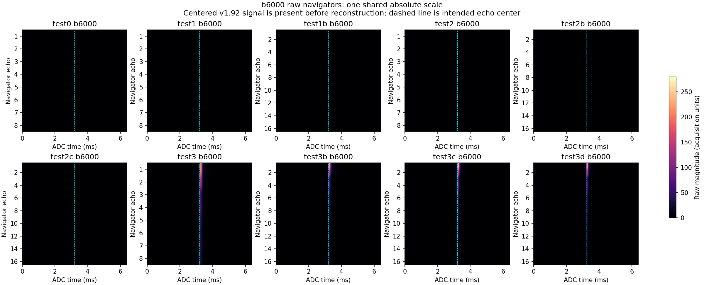
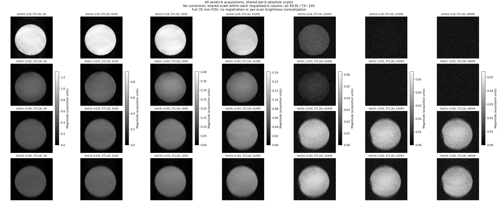
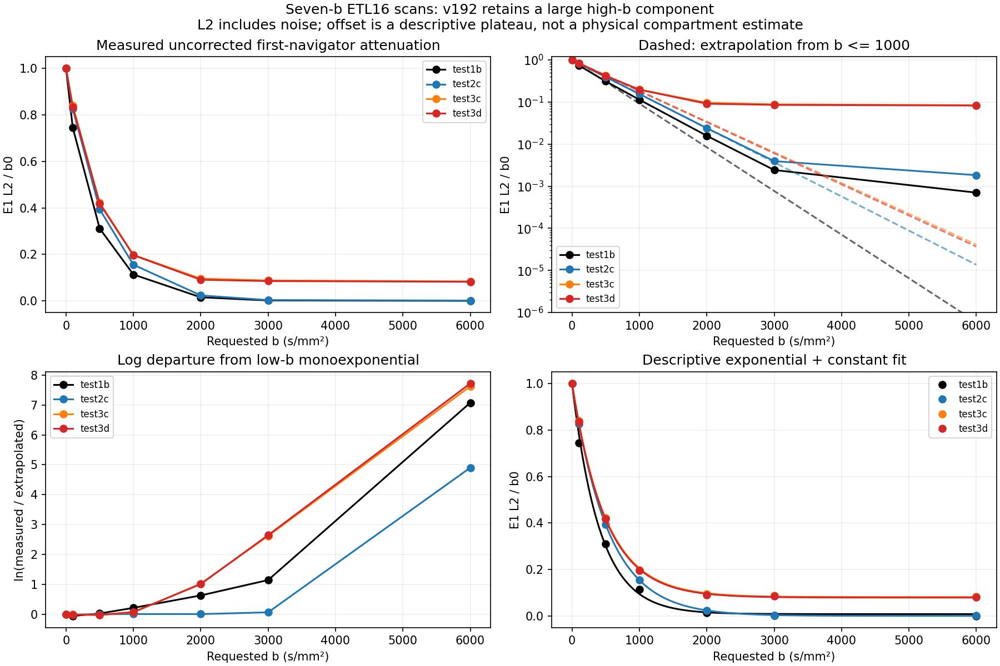
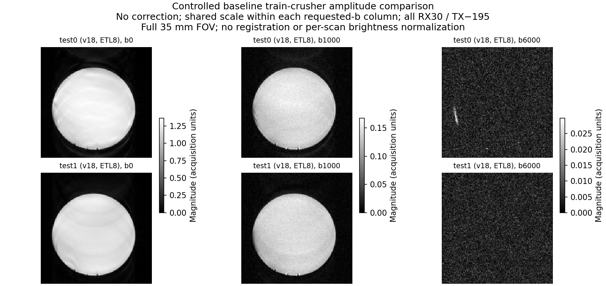
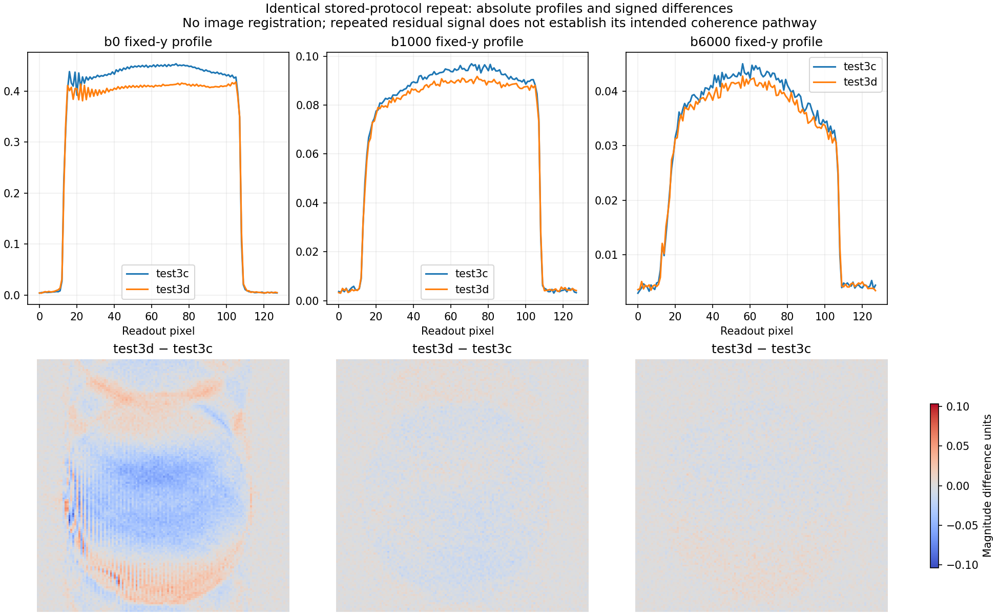
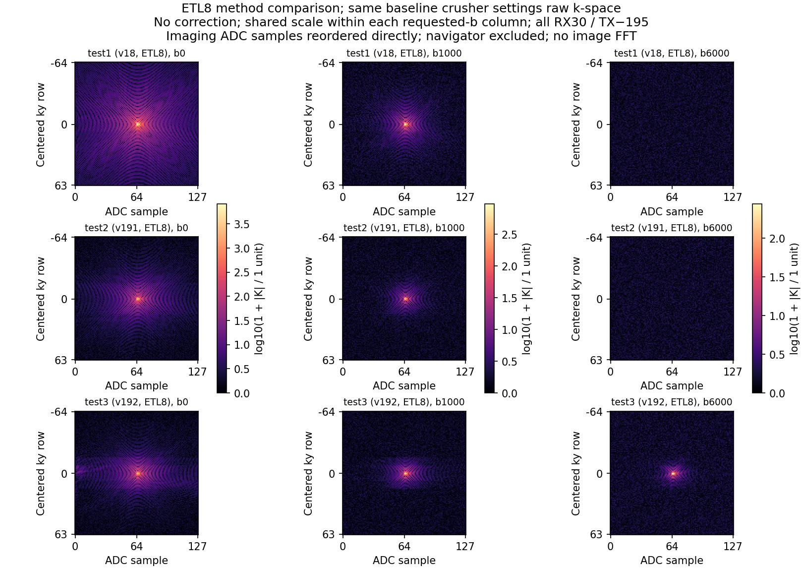
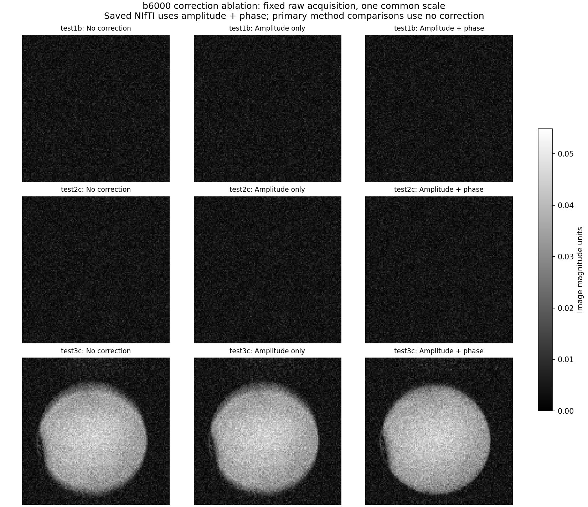

# Physical scanner experiments — October 7, 2026

**ss-MGOT (v1.91) is the more promising of the two new implementations, but it has not outperformed the v1.8 control in this session.** It produces recognizable b0 and b1000 images and suppresses object-shaped high-b signal to approximately the background level. The cost is substantial: at ETL8 its interior b1000 signal is 40% below the matching strong-crusher v1.8 control, and its echo train decays more strongly. Its broad interior shading is also greater. A clean b6000 image is evidence of suppression, not evidence of recovered diffusion signal or improved quantitative accuracy.

**Alsop (v1.92) produces usable-looking lower-b images but fails the water phantom's high-b suppression test.** The user confirmed that all scans used a water phantom, for which useful b6000 signal is not expected. Alsop nevertheless retains a large, coherent object-shaped component. It occurs before reconstruction, persists with navigator correction disabled, and returns in the repeat approximately 36 minutes later. The seven-b scans show a high-b plateau at about 8% of the first-navigator b0 amplitude. This is unwanted residual signal and the main problem to resolve before quantitative diffusion measurements. Alsop's brighter b1000 image than ss-MGOT cannot be treated as an unqualified sensitivity advantage while this contamination remains.

**The scan evidence is stronger than the build provenance.** The workspace PPLs are the sixth-trial files, while the latest documented validation and upload are the seventh-trial method-only files. Their intended method events were checked for equivalence in the local model, but the acquisitions do not identify the exact console executable or installed RF library. The mismatch does not prove that an old build ran or that compiler trouble caused today's findings.

This report covers all ten water-phantom scans and all 46 acquired diffusion volumes. Phantom identity comes from the user's clarification; it is not inferred from the circular images. Temperature and relaxation times were not supplied. The [catalog](../experiments/scan_catalog_2026-10-07.md) lists important parameters, every differing control, chronology, and protocol discrepancies. The [complete numerical analysis](data/physical_scanner_analysis_2026-10-07.json) and [protocol audit](data/oct07_protocol_audit.md) retain the detailed evidence. Conclusions below concern these acquisitions; they do not rank the published methods in general.

## What the new sequences are trying to achieve

An FSE sequence makes several echoes after one excitation. **ETL**, or echo train length, is the number of echoes in that train: eight or sixteen today. Each echo supplies different image information. Diffusion gradients give moving spins different phases. If the prepared magnetization has an unfavorable phase relative to the refocusing RF pulses, an ordinary train can oscillate or develop unwanted signal pathways. Phase-insensitive preparation is intended to make the train less sensitive to this starting phase. This is the problem addressed by [Alsop's original preparation](https://onlinelibrary.wiley.com/doi/10.1002/mrm.1910380404).

Both adaptations add a controlled phase pattern across the slice and recall a selected component before each acquisition. **v1.91, ss-MGOT**, tips the selected component onto the longitudinal axis, spoils the remaining transverse component, and re-excites the stored signal. **v1.92, Alsop**, uses an elimination pulse to retain the wanted transverse component and rotate the unwanted component away; it does not have ss-MGOT's storage/spoiler/re-excitation block. The ideal selection costs roughly half the signal. Finite RF profiles and relaxation can add losses. These mechanisms and ss-MGOT's original motivation are described in [Gibbons et al.](https://pmc.ncbi.nlm.nih.gov/articles/PMC6312718/). Today's RF pulses, geometry, and flip schedule are scanner adaptations, so published performance is not a prediction of today's intensity.

The new trains request refocusing angles of **142.2°, 94.9°, 69.2°, 63.0°, 60.2°, then 60°**, continuing at 60° for ETL16. Low-angle refocusing stores and recalls magnetization through several pathways; it is not simply the old train with weaker pulses. Both methods also use custom preparation RF and stronger train crushers. A **crusher** is a gradient intended to dephase unwanted pathways. More crusher area can also attenuate or accidentally recall particular pathways, so stronger crushing is not automatically better.

All protocols store TE 54 ms and ESP 14 ms, but **the 54-ms tag has different meanings**. It is the first image echo for v1.8 and the preparation echo for the methods. The intended first image echo is approximately **73.716 ms for ss-MGOT and 68 ms for Alsop**; later echoes add 14 ms. These are source-model times, not acquired timing traces. ss-MGOT's extra interval includes longitudinal storage, so its entire extra duration should not be converted into a T2 decay penalty. The [sequence review](data/oct07_sequence_review.md) explains the timing, RF, and pathway details.

## Acquisition controls and how the comparisons were made

All scans request TR 2000 ms, centric phase encoding, 128 imaging lines and 128 readout samples, one 1-mm slice, nominal FOV 35 mm, read-axis diffusion, δ 4 ms and Δ 40 ms. All use RX 30 and TX −195. The three-value scans request b=0/1000/6000 s/mm²; the seven-value scans add 100/500/2000/3000. Comparisons use the **b-value**, not experiment number: b1000 is volume 2 in a three-value scan and volume 4 in a seven-value scan.

The protocol embedded in each MRD is the acquisition record. The adjacent PPRs for **test1b, test2c, and test3b** are stale for `gp_init_var` and `SMY`. All ETL8 scans embed −1000/0.0305406; all ETL16 scans embed −1059/0.0323371. Thus ETL8→ETL16 includes a phase-gradient calibration change despite the same FOV tag. Within ETL16, test1b/test2c/test3c have matching recorded geometry/calibration. All sidecar b arrays and directions agree with the embedded protocols, and every expected binary volume is present.

The strongest comparisons are:

- **test0→test1:** only train crusher amplitude changes, −5482→−8223 DAC; the first diffusion crusher stays −5482. Today's test0 is ETL8, unlike October 5's single-echo test0.
- **test1/test2/test3:** v1.8/ss-MGOT/Alsop at ETL8, with matching recorded gains, geometry, nominal diffusion inputs, and crusher baselines. RF, preparation, recall gradients, and actual first imaging times intentionally differ.
- **test1b/test2c/test3c:** the corresponding seven-b ETL16 comparison. Test1b is a late control, acquired after test3c.
- **test3c/test3d:** identical embedded protocol/scanner records except the acquisition counter, approximately 35.78 minutes apart. No intervention is documented, but matching metadata cannot establish unchanged hardware or specimen state.

Acquisition order is test0, test1, test2, test3, test2b, test3b, test2c, test3c, test1b, test3d. The counters support elapsed time, not civil timestamps. Sequential acquisitions and the limited repeats leave drift as a confound. October 5 recorded TX −205, so across-day brightness comparisons are not gain-controlled.

Images were regenerated from complex MRD samples. Primary figures below have **navigator correction off**, retaining the acquired echo weighting. Separate figures compare amplitude-only and amplitude-plus-phase corrections. Every scan was also reconstructed with the saved-image settings: all ten NIfTIs match at relative error **2–3×10⁻⁸**, consistent with float32 rounding. This verifies reconstruction reproducibility, not the actual played RF/gradient timing.


Display scales are shared within each b column and are not normalized per scan. Separate b columns have separate scales; a bright b6000 panel is not comparable in absolute intensity to a bright b0 panel. All show the full field of view. Numerical units are acquisition units, without gain or RF-efficiency normalization.

## Image performance and the signal cost

The following values are mean magnitude in one fixed interior region, with no correction. The ROI is a radius 34-pixel disk centered at **x61, y71**. A radius 41–47 annulus samples the boundary region; distant top corners provide an empirical background reference. Object centroids vary by about one pixel, and no registration or scan-specific threshold changes the measurement ROI. The interior deliberately excludes the boundary. Background ratios describe empirical contrast, not calibrated SNR.

| Scan | Method / ETL | Interior b0 | Interior b1000 | Interior b6000 | b6000 interior / background |
|---|---|---:|---:|---:|---:|
| test0 | v1.8 / 8 | 1.2788 | 0.14646 | 0.00432 | 1.01 |
| test1 | v1.8 / 8 | 1.1901 | 0.14168 | 0.00435 | 1.05 |
| test1b | v1.8 / 16 | 1.1881 | 0.13161 | 0.00432 | 1.03 |
| test2 | ss-MGOT / 8 | 0.5416 | 0.08475 | 0.00432 | 1.01 |
| test2b | ss-MGOT / 16 | 0.5225 | 0.07696 | 0.00436 | 0.99 |
| test2c | ss-MGOT / 16 | 0.4782 | 0.07539 | 0.00437 | 1.04 |
| test3 | Alsop / 8 | 0.4486 | 0.09685 | 0.04675 | 10.91 |
| test3b | Alsop / 16 | 0.4587 | 0.09054 | 0.04268 | 10.27 |
| test3c | Alsop / 16 | 0.4453 | 0.09119 | 0.03961 | 9.10 |
| test3d | Alsop / 16 | 0.4154 | 0.08700 | 0.03847 | 8.83 |



**ss-MGOT:** Relative to test1, test2 retains **45.5% of b0 and 59.8% of b1000 interior signal**. Its first raw b0 navigator retains 40.3% of test1's norm. A large initial reduction is consistent with the intended selection cost and changed RF/geometry/timing; it is not by itself proof of malfunction. However, the clean high-b outcome is already obtained by the v1.8 control. This session therefore supports ss-MGOT feasibility and suppression, while leaving its hoped-for phase robustness unproven. No deliberate initial-phase perturbation or motion challenge was acquired.

The darker image also conceals shading. After modest Gaussian smoothing (σ 2 pixels), interior variation divided by mean is **5.8% at b0 and 5.6% at b1000 for test2**, versus **2.0% and 2.7% for test1**. The ETL16 ss-MGOT scans show about 6.1–6.3% at b0 and 6.0–7.3% at b1000. This metric includes broad shading, specimen variation, and residual noise; it does not isolate a specific artifact. It does prevent a claim that ss-MGOT is more homogeneous merely because its bands are less conspicuous on a shared brightness scale. Its b1000 fine-scale high-pass variation is also larger relative to the reduced mean.

**Alsop:** Test3 retains 37.7% of test1's b0 and 68.4% of its b1000 interior signal. It is brighter than ss-MGOT at b1000 but dimmer at b0. Its ETL8 b0 interior is relatively uniform, with smooth variation 1.65%, while b1000 is 2.81%. At ETL16, b1000 variation rises to 5.5–7.3%. Most importantly, every Alsop scan retains a clearly visible b6000 object with interior magnitude roughly 9–11 times its remote background. This is much larger than the v1.8/ss-MGOT floor. Extra b1000 brightness could include the same slowly attenuating residual, so it does not establish more useful primary diffusion signal.

Magnitude images have a positive noise floor even when the coherent signal has vanished. That explains the approximately 0.0043 values in v1.8 and ss-MGOT; treating them as zero or fitting them as primary signal would bias attenuation estimates. This property of magnitude MRI is described by [Gudbjartsson and Patz](https://pmc.ncbi.nlm.nih.gov/articles/PMC2254141/). Alsop's object/background difference is too large and organized to explain as the same uniform floor.



## Raw echoes distinguish suppression from unwanted retained signal

A **navigator** is an echo train with phase encoding suppressed. It provides a raw view of echo amplitude and shape before image reconstruction. Here its line L2 norm measures total complex amplitude across the readout; it includes noise and should not be equated with noise-subtracted signal. Comparing each line with its first echo after the best complex scaling also tests whether one amplitude/phase correction can describe the whole shape.

| Scan | First navigator b1000 / b0 | First navigator b6000 / b0 | Last / first navigator at b1000 |
|---|---:|---:|---:|
| test1, v1.8 ETL8 | 0.1155 | 0.000706 | 0.735 |
| test1b, v1.8 ETL16 | 0.1138 | 0.000704 | 0.577 |
| test2, ss-MGOT ETL8 | 0.1606 | 0.001792 | 0.443 |
| test2c, ss-MGOT ETL16 | 0.1559 | 0.001832 | 0.232 |
| test3, Alsop ETL8 | 0.2125 | 0.096030 | 0.202 |
| test3c, Alsop ETL16 | 0.1980 | 0.084078 | 0.098 |
| test3d, Alsop ETL16 | 0.1967 | 0.082610 | 0.109 |

ss-MGOT's first high-b navigator norms are about **6.8–7.3 units**, similar to v1.8's 7.0–7.3. Its larger high-b/b0 ratio arises chiefly because its b0 reference is smaller. That ratio is not evidence of extra high-b signal. Alsop's first high-b norms are **295–351 units**, about 40–50 times that floor, with a concentrated central echo and coherent spatial projection. A lower readout-edge fraction in Alsop reflects this strong centered residual; it is not evidence of better diffusion suppression.





The new methods **do not show a flatter measured echo train than v1.8** under these conditions. ss-MGOT's ETL8 b0/b1000 E8/E1 ratios are 0.446/0.443; Alsop's are 0.321/0.202; v1.8 test1's are 0.732/0.735. At ETL16, ss-MGOT ends near 0.23 and Alsop b1000 near 0.10, versus v1.8 near 0.58. This can reflect relaxation, finite RF profiles, low-angle pathway redistribution, accumulated gradient weighting, and calibration/timing differences. The raw data establish the decay but do not assign a unique cause.

The stored ideal eight-echo model predicts better late-echo retention, especially for ss-MGOT. That discrepancy merits investigation, but its no-relaxation/inferred-calibration outputs are not an absolute scanner prediction. No specimen T1/T2 or RF calibration measurement is supplied, and ETL16 is not the same simulation case. It would be unjustified to diagnose one faulty pulse from the retention ratios alone.

## The seven-b scans expose the Alsop plateau



For test3c, the first navigator ratios at b=0/100/500/1000/2000/3000/6000 are **1.000/0.840/0.423/0.198/0.0962/0.0883/0.0841**. Test3d gives **1.000/0.834/0.418/0.197/0.0913/0.0855/0.0826**. The signal stops decreasing appreciably above b2000. By contrast, ss-MGOT test2c continues to 0.0241 at b2000 and 0.00394 at b3000 before approaching its 0.00183 norm floor. The late v1.8 control also approaches its much smaller normalized floor.



A descriptive fit of `ratio = (1−f) exp(−D·b) + f` gives **f=0.0820 and 0.0798** for test3c/d. An anchored monoexponential over all seven b-values has RMS ratio errors 0.0499/0.0486; the offset model reduces them to 0.00444/0.00351. These are unweighted descriptions of an L2 norm, not physical compartment fractions or validated diffusivities. Components with different phase/shape do not generally add as positive scalar amplitudes. The v1.8 offset fit is also visibly imperfect, illustrating why a numerical offset alone does not identify leakage. Fits and residuals are in [the attenuation analysis](data/oct07_attenuation_fits.json).

The repeated plateau, its high spatial contrast, and its absence from the other methods establish a **method-dependent unwanted component in the water phantom**. A genuine slow-diffusing tissue compartment is not an appropriate explanation for these confirmed water scans. Incomplete elimination, unwanted coherence pathways, RF/gradient phase mismatch, or fresh magnetization contributing after diffusion preparation are plausible causes. These data do not uniquely choose among them. Ordinary magnitude noise also cannot explain a coherent phantom outline whose interior is nine to eleven times the remote background.

For scale, extrapolating ss-MGOT test2c's measured low-b attenuation predicts a b6000/b0 ratio of about **1.4×10⁻⁵**, or roughly 0.05 first-navigator units; its measured high-b norm is 6.8 units, consistent with a noise-dominated floor. Alsop test3c's actual first-navigator norm is 304 units. Even its contaminated low-b-only fit predicts a ratio of4.1×10⁻⁵, far below the measured 0.084. These extrapolations describe the observed curves and are not water-temperature calibrations, but they show why Alsop's residual cannot be counted as successful diffusion signal.

The low-b ss-MGOT test2c curve is approximately monoexponential with a descriptive requested-b slope **0.00187 mm²/s**. The v1.8 curve is steeper and less monoexponential; Alsop's slope changes when its plateau is included. These differences are not sufficient to infer different specimen diffusivities. Requested b labels omit additional gradients and pathway-specific weighting. Historical source calculations also place v1.8's read prephaser inside its diffusion pair, creating cross terms, while the methods move it afterward. Nominal b0 is not strictly zero total gradient weighting. None of the historical modeled b-tensors is substituted for a verified, per-scan played waveform today.

## Crusher and echo-train controls



Increasing the train crusher from −5482 to −8223 (test0→test1) reduces interior b0 by 6.9% and b1000 by 3.3%, and reduces broad interior variation. Both already have background-level high b; the larger crusher has no demonstrated high-b suppression advantage in this pair. The first raw b0 navigator changes by only 0.14%, consistent with the first diffusion crusher being unchanged. This control helps separate the new preparation/RF effects from the stronger train-crusher setting. It does not imply that this crusher area is optimal for every pathway.

ETL16 gathers 128 imaging lines in eight imaging shots rather than sixteen, with an extra unencoded navigator shot in both cases. It adds later echoes without changing nominal image resolution. At fixed TR and neglecting dummies/overhead, that is17 versus9 shots per diffusion volume; actual runtime is not inferred from file modification times.

Test2→test2b reduces ss-MGOT interior b0 by 3.5% and b1000 by 9.2%; test3→test3b reduces Alsop b1000 by 6.5% and high b by 8.7%, while its b0 rises 2.3%. Test1→test1b changes b0 very little and reduces b1000 by 7.1%. These are descriptive comparisons because ETL co-changes phase calibration and some scans add b entries or occur later. Centric encoding puts central image information early in the train, so a dramatic loss of late navigator amplitude need not cause equally dramatic loss of mean image brightness. Later echoes still influence boundary definition and spatial weighting. A circle alone cannot establish sharper resolution or a better point-spread function; an edge/grid phantom would be needed.

Test3d's repeat interior means change **−6.7% at b0, −4.6% at b1000, and −2.9% at b6000** relative to test3c. The gross residual and attenuation plateau reproduce; the detailed pixel pattern and baseline are not identical. Two repeats do not provide a reliable variance estimate or demonstrate full stability.



## K-space and reconstruction checks

**K-space** is the complex encoded data from which the image is reconstructed. The panels reorder the imaging ADC samples directly into centered phase-encode rows and exclude navigators; they are not Fourier transforms of magnitude images. Horizontal coordinates are ADC sample indices, not calibrated physical kx. Each b column uses a common `log10(1 + |K| / 1 unit)` scale across scans. Permutation conserves power, and Fourier reconstruction passes Parseval energy checks.



Alsop has strong centered high-b structure in the **encoded imaging data as well as the navigator**. This differs from the pronounced readout-edge contamination seen in several October5 positive/alternating-crusher scans. Similar brightness is not evidence of the same mechanism. The v1.8 and ss-MGOT high-b data are predominantly a distributed floor, with small residual structures; no claim of perfectly artifact-free acquisition is made.



The saved reconstruction applies an amplitude deramp and one navigator-derived phase per echo. It removes envelope steps while retaining a fitted trend; it does not flatten all echo decay or separate coherence pathways. At b1000, full correction changes Alsop's magnitude image by about 3.6–4.1% in global L2, but its interior mean by less than 0.1%. At high b it changes the spatial pattern by roughly12–15% while the unwanted object remains. The residual is therefore not created by this correction.

For v1.8/ss-MGOT at high b, navigator shape residuals are near1 and projection phase coherence is very low: phase estimates are dominated by noise. Full correction rearranges the noise magnitude pattern by roughly44–66% in global L2 while changing interior means by less than 1.4%. That is not signal recovery. These ablations support using **correction off as the primary high-b assessment**, and judging any phase correction at measurable signal with spatially resolved diagnostics. A scalar navigator does not establish phase agreement between every imaging shot.

All images, including intermediate b-values, are available in the [first contact sheet](figures/physical_scanner_2026-10-07/all_scans_1.png), [second contact sheet](figures/physical_scanner_2026-10-07/all_scans_2.png), and individual seven-b sheets for [test1b](figures/physical_scanner_2026-10-07/test1b_seven_b.png), [test2c](figures/physical_scanner_2026-10-07/test2c_seven_b.png), [test3c](figures/physical_scanner_2026-10-07/test3c_seven_b.png), and [test3d](figures/physical_scanner_2026-10-07/test3d_seven_b.png). Complete raw comparisons are in [k-space sheet1](figures/physical_scanner_2026-10-07/kspace_all_scans_1.png), [sheet2](figures/physical_scanner_2026-10-07/kspace_all_scans_2.png), and [readout/phase profiles](figures/physical_scanner_2026-10-07/kspace_profiles.png).

## Revised PPLs and what remains unverified

The compatibility history was reviewed through the seventh trial. It includes forward-label changes, warning reductions, branch restructuring, RF-library formatting, and finally removal of the unused v1.8 kernel/features to reduce the program image. The seventh trial requires `v19_on=1`; v1.8 controls run separately. Old documentation suggesting a v19 method-off control is superseded.

Direct byte comparison found:

| Artifact | Workspace identity | Latest documented identity |
|---|---|---|
| v1.91 PPL | v6 RF-fix, SHA starts `92bdcb79` | v7 method-only, `6a0d222b` |
| v1.92 PPL | v6 RF-fix, SHA starts `373d10d4` | v7 method-only, `0adcd5ad` |
| Current scanner PPRs and six custom RF files | Match v7 upload bytes | v7 |

This is a substantive source difference, not line-ending conversion. Full hashes and checks are in the [sequence review](data/oct07_sequence_review.md). The method-only documentation records model event equivalence over 47 protocols per method, supporting the intended unchanged sequence. The earlier 64K overflow explanation was an estimate for simulator errors, not a measured diagnosis of today's scans.

The MRDs identify sequence paths and parameters but contain no hash of the compiled console program or installed RF waveforms. No acquired gradient/RF/ADC trace accompanies them. Also, the six custom RF frames use inferred multipliers from `rfcal=594`; their actual achieved flip angles are not documented. The stock `alpha`, `p180_scale`, and `rfnum` values are bypassed on the method path. Consequently, today's successful acquisitions establish that data were obtained under these names, but do not hardware-validate one archived build or its modeled pulse calibration.

## Follow-up experiments that would answer the remaining questions

1. **Capture the build and RF provenance.** Archive console-side PPL/PPR, compiled executable, all six installed RF assets, hashes, compiler listing, and available RF/gradient/ADC timing trace with each scan. Resolve the workspace-v6/upload-v7 discrepancy before interpreting a source-level fix as the explanation of a scan change.
2. **Calibrate the custom RF pulses and check the b0 train first.** Measure preparation90/180, elimination/tip-up, re-excitation, and imaging-frame scaling under the same TX setting. Verify relative RF phase and selector/rephaser timing. Compare measured b0 navigator shapes and retention with a model using measured specimen T1/T2. This can distinguish expected low-angle/relaxation losses from RF or timing errors.
3. **Target the Alsop residual with intermediate b-values and a matched control.** Repeat b0/100/500/1000/2000/3000/6000 at ETL8 with fixed geometry and acquisition settings. Keep correction off for the raw comparison. Examine whether the residual tracks elimination-pulse calibration or phase, using deliberately validated variants. A persistent object after strong attenuation should be traced to a pathway before it is used in diffusion fitting.
4. **Test the claimed phase robustness directly.** Interleave v1.8, ss-MGOT, and Alsop acquisitions at the same ETL/calibration, and include controlled preparation-phase offsets with documented sequence variants. Repeat the starting control at the end. Today's static comparison does not show whether ss-MGOT compensates for unfavorable diffusion phase.
5. **Separate ETL from calibration and quantify spatial definition.** Hold phase calibration constant across ETL8/16 and retain the same active b array. Use an edge/grid phantom, record noise separately, and assess signal, shading, boundary response, and echo shape together. Extend the verified event model to the acquired ETL16 protocol and calculate per-echo total b weighting before fitting quantitative diffusion.

The next practical priority is a calibrated ss-MGOT b0/echo-train check and a focused Alsop residual investigation, with the strong-crusher v1.8 protocol retained as the reference. None of today's data supports adopting Alsop's high-b brightness as useful diffusion signal, or accepting ss-MGOT's reduced brightness as an overall improvement without the phase-robustness test.

## Reproduction and verification

Run from the repository root:

```text
python docs/data/oct07_protocol_audit.py
python docs/data/physical_scanner_analysis_2026-10-07.py
python docs/data/oct07_attenuation_analysis.py
python docs/data/verify_physical_scanner_2026-10-07.py
```

The scripts read the original scanner files and write derived documentation, figures, and tables only. [Image measurements](data/oct07_image_measurements.csv), [raw k-space measurements](data/oct07_kspace_measurements.csv), [attenuation fits](data/oct07_attenuation_fits.csv), source hashes, fixed ROI coordinates, alignment, correction ablations, and repeat differences support the numerical statements. [Independent verification](data/oct07_independent_verification.json) reads raw binary data separately, checks dimensions and sidecars, reproduces the centric mapping/NIfTIs, and verifies energy conservation and reported measurements. Original scans and sequence-development files were preserved.
