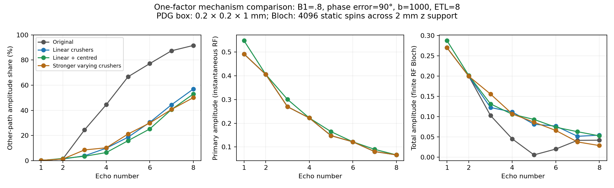
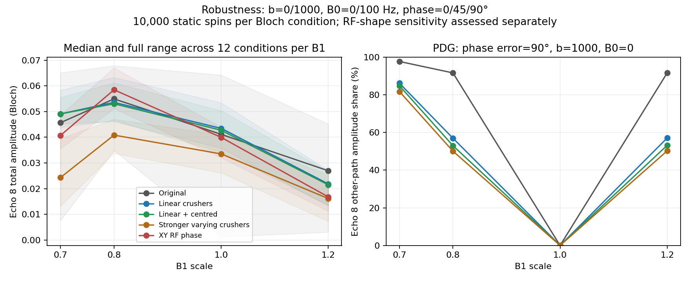
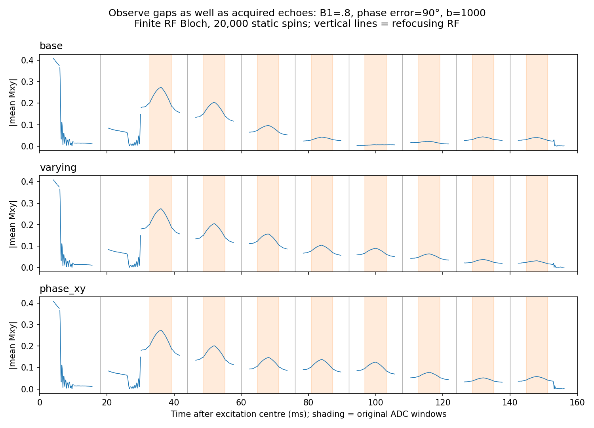

# DW-FSE PPL/PPR investigation and improvements

2026-10-03. Source: unchanged `scanner/FSE_dwi_CPMG_non_CPMG_twoTE-1.6.ppl`
and its current PPR. All PPL line numbers below refer to that original file.

## 1. Summary

The dominant acquired-signal weakness is the accumulation and interference of
non-primary coherence histories after imperfect refocusing. The current ETL-2,
b=0 PPR conceals this behavior. The best **balanced phantom-test candidate** is
a symmetric, linearly increasing train-crusher amplitude, combined with the
existing refocusing-centering correction. At ETL 8, B1=.8, its eighth-echo
non-primary amplitude share falls from **91.6% to 53.0%**; the primary amplitude
is unchanged in the static, instantaneous-RF model. Across 48 finite-RF Bloch
conditions, median eighth-echo total amplitude increases **10.3%** (0.04111 to
0.04535), and the measured grid minimum increases from 0.00121 to 0.01362.
These are equal-weight grid summaries, not expected patient SNR.

There is a trade-off: aligned cases can lose reinforcing stimulated signal,
and added crusher diffusion weighting reduces the eighth-echo primary by
**8.3%** in the tested water-diffusion model. A stronger varying-moment candidate
reaches 49.0% non-primary share but lowers the grid median signal; it is an
optional purity experiment, not the preferred compromise. RF phase cycling
improves some magnitude responses without reducing the measured pathway share.
No tested design removes all contamination across B1=.7–1.2.

Demonstrated correctness issues include the known independent-crusher RF
centering defect, nominal-versus-total b-value mismatch, and a newly replayed
scratch-memory alias in the diffusion-OFF PE-order-0 branch. Two pipeline issues
were corrected: heuristic pathway weights presented as signal shares, and false
timing failures when reading fine-raster Pulseq files. Original scanner files
and default generated waveforms are preserved. Scanner corrections are supplied
as reviewable patches; compilation and physical phantom validation remain open.

## 2. Metrics, baseline, and evidence

The mechanistic baseline has TE=36 ms, ESP=16 ms, ETL=8, 16 imaging lines,
diffusion table [0,1000] s/mm² with two diffusion acquisitions/two experiments,
read-axis diffusion, and the shot with ky=0 at **echo 1**. The first refocusing
interval is 18 ms; subsequent half-intervals are 8 ms. Important experiments
retain nonzero diffusion gradients. `runs/improve_ppr_original` separately
reproduces the original ETL-2 PPR. The experiment design was recorded before
screening in [ppl_experiment_log.md](ppl_experiment_log.md).

For acquired echo j, P is the complex contribution from transverse coherence
that conjugates at every refocusing RF and is never stored longitudinally.
It is selected by the explicit alternating history `+ - + - ...`, rather than
by strongest amplitude. S is the magnitude of the sum of all complex histories.
The non-primary amplitude share is

`U = sum(|other coherently grouped RF histories|) / sum(|all such histories|)`.

This is an L1 amplitude share, **not signal power, artifact intensity, or the
fraction of net signal attributable to a probability**. Histories can cancel;
the coherent other-path sum and relative phase are saved too. Stimulated paths
may support useful CPMG signal, so lower U alone cannot justify a change.

Two models are kept distinct:

* **Phase distribution graph (PDG), a generalized extended phase graph:**
  exhaustive, unpruned RF-history enumeration at the upper-middle ADC sample;
  one 0.2×0.2×1 mm box voxel; instantaneous RF. The implementation independently
  sums to MRzero's acquired signal. The original ETL-8 baseline closure error is
  2.5×10^-7; the largest relative closure error across the closed screening
  cases is 1.2×10^-4, with no magnitude threshold in the enumerator.
* **Bloch:** finite sinc RF, slice selection, T1=1.5 s, T2=80 ms, T2′=30 ms,
  0.2×0.2 mm in-plane support and 2 mm z support. Screening uses 4096 stratified
  static spins, robustness 10,000, and selected checks 40,000/two seeds and a
  2-µs RF time step. Bloch totals include the slice profile and have a different
  volume normalization from PDG. Their absolute amplitudes must not be equated.

Static comparisons use PDG D=0. Nonzero b denotes played diffusion gradients,
not Brownian motion in Bloch. An excitation-only phase offset of 0/45/90° is
a **coherent motion-phase surrogate**, not a moving-spin or random-phase model.
The separate water check uses D=0.001 mm²/s (MRzero D=1).

Compact committed evidence: [screening](data/improvement_screen.csv),
[robustness](data/improvement_robustness.csv), [pathways](data/improvement_pathways.csv),
[sensitivity](data/improvement_sensitivity.csv), [model checks](data/improvement_model_checks.csv),
and [aggregate numbers](data/improvement_summary.json). Each measurement carries
its descriptive `runs/improve_*` path. [Provenance](data/improvement_provenance.json)
records the unchanged PPL/PPR hashes and dependency versions.
Raw sequences, exact overrides, settings,
complex signals, `view.txt`, and summaries remain under those ignored run paths.



## 3. Problems found

| Finding | Evidence and implication | Status / severity |
|---|---|---|
| Independent crushers cancel 180-RF gradient-delay compensation | PPL:1316–1317 cancel `+rfdelay` at 3543. At the assumed 60-µs physical lag, baseline odd echoes have slice-axis k≈250.2 m^-1; the corrected candidate has ≈−5.2 m^-1. TE/ESP and Δ are unchanged in the generated comparison. | Demonstrated timing arithmetic defect; moderate, hardware-delay dependent. |
| Current PPR is an inadequate diffusion-FSE qualification protocol | PPR:8/68–69/272 has ETL 2, TE=ESP=36 ms, one diffusion row; b=0. In ETL-8 PDG, U grows from 1.25% at echo 2 to 91.6% at echo 8 for B1=.8. | Demonstrated test-coverage weakness; high for interpreting robustness. |
| Constant train moments preserve unwanted histories | `improve_screen_base_b1000_ph90` versus `linear_crushers`: U8 91.6→56.9%; P8 unchanged at 0.06675. Uniform doubling yields U8=91.4%. | Demonstrated weakness under imperfect RF; high. |
| Protocol b label omits imaging/crusher contributions | Baseline `view.txt`: requested 1000, trace b≈1119.7 at echo 1 and 1149.6 at echo 8. Balanced centred candidate: 1119.5 and 1236.8. PPL:575–585/721–780 computes the diffusion-lobe approximation. | Demonstrated modeling/calibration mismatch; high for quantitative diffusion. |
| PE-order-0 scratch arrays overlap | PPL:263–283 reserves 512 centre words; one-based writes at 999/1008 reach index 1024 for ETL 512. Location writes at 1022–1023 and GP writes at 1051 alias later reads at 1042. Replay finds three changed PE values. | Demonstrated source defect, high when triggered; dormant in current DWI, which excludes PE 0 at 816–821. |
| EPG report used graph-construction estimates as signal fractions | Old `epg.py` multiplied `prepass_mag` ancestry by scalar `emitted_signal`, omitting acquired-sample weighting. It also failed to conjugate RF factors under nested conjugation. | Demonstrated pipeline defects; fixed. |
| Fine-raster files failed timing checks after readback | File raster=1 µs; PyPulseq `system` retained constructor 10-µs defaults. `simulate.read_seq` now synchronizes advertised raster attributes. Roundtrip test passes. | Demonstrated pipeline false failure; fixed without changing spin evolution. |

The concrete PE-memory replay uses diffusion OFF, PE_order=0, no_views=1024,
ETL=512, TE=ESP=36 ms, one slice, and TR=30,000 ms to accommodate the long train.
[Archived replay](data/improvement_pe_memory.json) records the layout and three
mismatches. This is a memory-address proof, not a scanner-language overflow claim.
The ETL-256 boundary writes an unused location word; it was **not** accepted as
proof of corrupted output. The proposed guard conservatively protects the full
reserved regions. Unsupported PE order 0 is not newly added to the generator.

Previously reported concerns remain: the vendor RF frame is unavailable; the
71% bandwidth convention is unresolved (PPL:1327–1333); phase-gradient integer
truncation persists (`gp_inc=-40` in these runs); and the diffusion approximation
uses 6.3² rather than (2π)². The DAC-1 b=0 workaround is explicit at PPL:762–770;
there is insufficient evidence to remove it. These are distinct from newly
demonstrated memory and measurement defects. No new scanner integer-overflow
claim was established.

## 4. What was tried

Every screening comparison changes one factor from `base`: B1=.8, B0=0,
b=1000, ETL 8, phase 0/90°. Values below are echo 8; S is **finite-RF Bloch**.
All rows, phases, and earlier echoes are preserved in the screening/pathway CSVs.

| Modification / hypothesis | U8 (%) | P8, PDG | S8 at phase 0 / 90° | Decision |
|---|---:|---:|---:|---|
| Original | 91.6 | .06675 | .0704 / .0418 | Baseline |
| Centre refocusing gradients | 92.0 | .06675 | .0742 / .0425 | Correct timing; does not itself purify train |
| Equal first/train crusher amplitudes | 91.8 | .06675 | .0689 / .0389 | No useful suppression here |
| Double both crusher amplitudes | 91.4 | .06675 | .0631 / .0407 | Larger constant moments do not break recurrences |
| Alternate crusher polarity | 85.6 | .06675 | .0166 / .0194 | Signal loss outweighs modest purity gain |
| Halve train crusher duration | 92.1 | .06675 | .0682 / .0146 | Reject; phase-offset signal worsens |
| Linear symmetric amplitudes | 56.9 | .06675 | .0586 / .0542 | Best balanced individual change |
| Stronger varying amplitudes | 50.1 | .06675 | .0419 / .0286 | Purity gain with excessive total-signal loss |
| Irregular lower-amplitude table | 64.6 | .06675 | .0446 / .0246 | Reject relative to linear compromise |
| ESP=TE=36 ms | 95.8 | .01160 | .0130 / .0234 | Much longer train; does not establish matched timing is superior |
| Nominal refocus 160° / 200° | 97.3 / 71.8 | .02702 / .11662 | .0699/.0166; .0702/.0103 | Neither improves both phases; no overflip recommendation |
| RF Hanning / bandwidth-matched model | 91.6 / 91.6 | .06675 | .0585/.0118; .0456/.0091 | Large finite-RF sensitivity; obtain actual frame |
| RF 180° phase alternation / XY / quadratic table | 91.6 each | .06675 | .0423/.0709; .0573/.0606; .0659/.0607 | Reweights interference; not demonstrated purity improvement |
| Post crusher OFF / read prephaser 110→100% | 91.6 / 91.7 | .06675 | .0704/.0418; .0705/.0415 | No acquired-echo advantage at these conditions |

Equal-interval comparison adds 140 ms by echo 8 (148→288 ms): its primary loss
is largely the longer transverse relaxation time. It is a controlled protocol
change, **not an isolated proof that unequal first spacing causes every artifact**.
The initial report's short-train timing conclusion should therefore not be used
as a recommendation to lengthen ESP in this protocol.

Combinations were tested only after their components: linear+centred gives
U8=53.0%, P8=.06675, S8=.0565/.0525; stronger varying+centred gives 49.0%,
.06675, .0445/.0272; XY+centred gives 92.0%, .06675, .0523/.0593. The centroid
fix and crusher changes interact; their signal benefits are not simply additive.

Quadratic offsets are the explicit exploratory law `65*k*k mod 360`, k=0..7,
quantized to hardware phase units. They omit stabilization and reconstruction
required by published non-CPMG work. Le Roux and McKinnon's original
[ISMRM study](https://cds.ismrm.org/ismrm-1998/PDF2/p0574.pdf) describes a quadratic
sweep near 130°, modified early pulses, and nonstandard reconstruction. Our
short table is a probe of interference, not a validated implementation of that
method. Receiver phases remain unchanged in phase-table experiments; magnitude
responses alone cannot qualify reconstruction of their complex echo families.

The post-train crusher cannot alter an echo acquired before it. With eight
dummy TRs at TR=2 s, turning it off changes acquired Bloch amplitudes by at most
2.2×10^-13 ([steady-state check](data/improvement_steady8.csv)). This does not
justify removing it for shorter TRs, other preparations, or scanner eddy currents.



## 5. Ranked recommendations and scanner implementation

### A. Test the linear crusher candidate, retaining the centred option

The balanced parameter file is [improvement_candidate.json](params/improvement_candidate.json).
Symmetric crusher DACs around RFs 1..8 are
**2754, 5482, 7675, 9868, 12060, 14253, 16446, 18639**. First and second RFs keep
their original amplitudes. Later train amplitudes increase by 40% of the base
per echo, with nearest-DAC rounding. Symmetry retains the primary spin echo;
changing moments prevents many longitudinal-storage histories from repeatedly
returning to the acquired sample.

| Candidate | U8 at B1=.8 (%) | P8, static PDG | Bloch S8 grid minimum / median / maximum |
|---|---:|---:|---:|
| Original | 91.6 | .06675 | .00121 / .04111 / .06785 |
| Linear only | 56.9 | .06675 | .01326 / .04686 / .06327 |
| Linear+centred | 53.0 | .06675 | .01362 / .04535 / .06121 |
| Stronger+centred | 49.0 | .06675 | .00621 / .03004 / .05062 |
| XY phase only | 91.6 | .06675 | .01125 / .04056 / .06703 |

Each grid has 48 conditions: B1 .7/.8/1/1.2 × B0 0/100 Hz × b 0/1000 × phase
0/45/90°. Linear-only leaves the centre-of-k-space echo amplitude exactly
unchanged. The centred versions have echo-1 ratios **.971–1.095** versus original.
The primary is unchanged by varying crushers at D=0; at B1=.7, however,
U8 remains about 85% for the balanced candidate. High-B1 total-signal medians
can decrease. Near-null original grid minima are sensitive to sampling noise;
the absolute minima are reported without claiming an SNR multiplication factor.

Dense phase-90° checks at B1=.8/b1000 give S8=.04081 original, .04968 linear,
and .04533 linear+centred. A second 40,000-spin seed gives .03972/.05193/.04760.
Hanning RF gives .01072/.03820/.03519: the direction of this phase-offset benefit
survives, but its magnitude and aligned response are RF-model dependent.

**Trade-offs:** TE=36 ms, ESP=16 ms, δ=4 ms, Δ=20 ms, TR=2 s and RF energy
are unchanged. Gradient peak increases **215.6→340.0 mT/m**, maximum modeled
slew **1078→1700 T/m/s**; both stay within this generator's scanner assumptions.
These unusually high limits belong to the modeled small-animal system, not a
generic human scanner. RF waveform energy is unchanged; actual SAR is not
computed. The balanced candidate's total b at echo 8 increases
**1149.6→1236.8 s/mm²**, with extra slice-direction weighting.
At D=.001 mm²/s, PDG P8 decreases **.02115→.01939**, S8 at phase 90° decreases
.03215→.02809, and U8 still improves **92.1→62.2%**. Thus the static improvement
does not preserve all primary signal in diffusing water.

**PPL port:** matrices at 3080/3089, refocus selection at 3531 and the switch
at 3737. Add a bounded PPR `crusher_step_pct` (0 restores original, 40 is tested),
or an ETL-sized amplitude table. For train RF k≥2, use
`crush_amp + (IntToLong(crush_amp)*IntToLong(crusher_step_pct)*IntToLong(k-2)+50L)/100L`;
RF 1 keeps `diff_crush_amp`. Check product/result bounds and update an inactive
secondary matrix before its next refocusing list; budget instructions without
extending RF/ADC centres. Both lobes must use the same value. Details and timing
qualification requirements are in [scanner patch notes](../scanner/patches/README.md).
The simulator accepts the explicit ETL table through `sim_train_crusher_scales`.

### B. Correct the independent-crusher centering arithmetic

The [centering patch](../scanner/patches/refocus_centering.patch) removes
`-rfdelay/+rfdelay` from pre/post pads at 1316–1317. Their sum is unchanged;
the RF start/post wait at 3543/3596 again provide gradient-delay compensation.
No new PPR parameter is required. The separate `centered` run does not reduce U8;
its Bloch median S8 is .04149 versus .04111 original. Recommend it for timing
correctness rather than claiming it solves stimulated echoes. Validate the
assumed 60-µs physical group delay and instruction overhead before applying.

### C. Record the complete b tensor and repair the dormant memory guard

For quantitative diffusion, calibrate the complete gradient waveform for each
direction/echo, including crushers and imaging cross-terms, and record a b tensor
rather than silently equating `acq_b` to achieved weighting. The linear candidate
adds slice weighting: merely lowering read-axis diffusion DAC cannot undo its
tensor change. This requires offline waveform calibration/metadata and possibly
an exposed corrected diffusion-table input; no scanner b-search replacement is
claimed here. PPL calculation hooks are 575–585/721–780 and matrix directions
2160–2162. Retain the b=0 DAC workaround until experimentally tested.

Apply the [PE-order-0 guard](../scanner/patches/pe0_scratch_guard.patch) before
the one-based arrays at 987; no new PPR parameter is required. It protects legacy
diffusion-OFF orders and changes no current DWI acquisition or signal amplitude.
Both patches pass `git apply --check`; neither has been scanner compiled.

## 6. Confidence, limits, and next physical tests

The pathway reduction is well supported **within the stated models**; universal
scanner/SNR improvement is not established. PDG uses instantaneous RF and a box
profile; Bloch uses an inferred sinc and includes a 90°/180° profile mismatch.
PDG becomes perfectly pure at calibrated B1=1 while finite-RF Bloch still has
profile effects. This is an expected model difference, not proof that the RF
frame is ideal. Hardware gradient lag, linear ramps, calibrated refocusing
flip, and simplified instruction timing remain assumptions.

Spatial support matters: at B1=.8/phase90°, changing PDG z support from .5 to
2 mm changes original U8 from 92.3→90.1%, balanced U8 from 60.4→47.6%.
Reduction survives those sizes, but the absolute share is voxel dependent.
The enumerator mirrors MRzeroCore 1.1.1's longitudinal-diffusion expression,
which lacks the (2π)² factor used by its transverse b integration; it is flagged
in JSON. Water-model primary attenuation is more secure than stimulated-path
diffusion fractions. Validate/fix that upstream convention before relying on
diffusion-weighted U as a physiological prediction.

The largest closed spatial-support comparison error is 1.7×10^-4 relative.
Selected 2-µs versus 10-µs RF-step S8 values agree closely; different spin seeds
shift small tail amplitudes by several percent. The finite-RF model does not
decompose its own primary paths, so preservation of its desired signal is not
proved merely by its total S. Motion phase is coherent, diffusion directions are
read-axis only, T1/T2 are fixed, ETL is 8, and full imaging reconstruction/eddy
currents are outside this investigation.



The diagnostic adds observation ADCs only to RF-free blocks, leaving RF/gradients
unchanged; it is not a scanner proposal. It confirms that evaluating only the
centre sample misses signal between windows and broad overlapping responses.
Per-window secondary maxima and peak displacement are archived; low-level
maxima are not automatically classified as a separate echo pathway. Changing
the read prephaser from 110% to 100% did not demonstrate useful suppression.

Concrete next tests:

1. Obtain the actual RF frame and measure excitation/refocusing slice profiles
   plus B1 maps. Repeat original/linear/centred-linear with ETL 8 and a longer
   train, recording complex echoes separately at RF scales spanning .7–1.2.
2. Use a stationary water phantom at b=0/1000 along read, phase, slice and an
   oblique direction. Compare measured decay with complete b tensors; require
   preserved centre-of-k-space SNR and acceptable desired-signal diffusion loss.
3. Measure gradient/RF plateau alignment and TE/ESP/Δ on the original and patched
   centering sequence. Sweep calibrated `rfdelay`; check off-centre slices too.
4. Introduce controlled translation during diffusion preparation, or a calibrated
   phase perturbation before the train. Compare all complex echo families and
   reconstructed images. Test shorter TRs before removing the post crusher.

### Reproduction and source validation

From the repository root (MRzeroCore/torch are required for pathway checks):

```bash
python dw.py run improve_ppr_original --b1 0.8 1.0 --n 10000
python examples/improve_ppl.py screen
python examples/improve_ppl.py screen --variants combined,centered_xy,centered_linear
python examples/improve_ppl.py robust --variants base,centered,varying,combined,phase_xy,linear_crushers,centered_linear
python examples/improvement_pathways.py --group screen --closure
python examples/improvement_pathways.py --group robust --variants base,varying,combined,linear_crushers,centered_linear --b1 0.7 0.8 1 1.2
python examples/improve_ppl.py sensitivity --variants base,varying,combined,phase_xy,linear_crushers,centered_linear
python examples/improvement_checks.py
python examples/improvement_observe.py
python examples/improve_ppl.py steady --variants base,post_off
python examples/audit_pe_memory.py
python examples/summarize_improvement.py
python -m unittest discover -s tests -v
```

The `steady` command reproduces the two eight-dummy comparisons at 4096 spins;
their exact overrides and settings are saved in their run folders. The archive contains 412
Bloch conditions, including 336 robustness conditions. Eleven tests pass,
including default generated-event equality, timing readback, parameter bounds,
phase isolation, and analytic-primary/MRzero closure. Generated candidates pass
the modeled timing/gradient checks; scanner certification is not implied.
